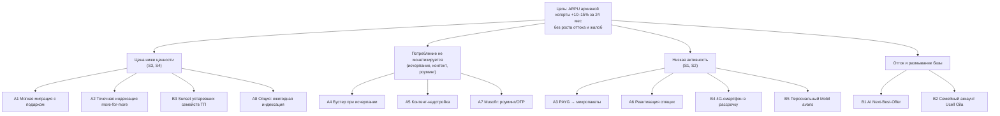

# 01. Discovery: проблема, гипотезы, сегменты

> Этап выполнен мной (кабинетная часть). Шаги, где нужны **ваши данные и ваш анализ**, отмечены значком
> 🟨 **ЗАДАЧА ДЛЯ ВАС** и подробно расписаны в [09_data_request_for_analysts.md](09_data_request_for_analysts.md).

## 1. Постановка проблемы

**Проблема.** Абоненты на архивных (закрытых для подключения) тарифах платят заметно меньше, чем
абоненты актуальной линейки (Bor / Foydali / Doimiy / Ehtirom), хотя часть из них потребляет столько же
или больше. Архивная база «законсервировала» старые соотношения цена/объём, в то время как:

- рынок перешёл к more-for-more: Ucell с 03.02.2026 поднял абонплату ряда ТП на 5 000 сум с добавлением ГБ
  («Yaxshi kayfiyat» 22→27 тыс., «Ovoz» 20→25 тыс., «Doimiy Start» 29→34 тыс. и др.);
- конкуренты делают то же (Beeline Oila Max 105→125→155 тыс. сум, март 2026);
- инфляция 7,3% (2025) и ~6,5% (прогноз ЦБ на 2026) обесценивает фиксированную абонплату;
- архивные ТП дороги в сопровождении (каталог, биллинг, контакт-центр) и мешают управлять ценой.

**Формулировка цели (SMART).** За 24 месяца поднять ARPU когорты архивных абонентов на **≥10%**
(стретч — 15%) при оттоке когорты не выше базового + 0,3 п.п. в месяц и без роста жалоб
в регулятор, сохранив долю рынка Ucell (≥30%).

## 2. Ключевое определение метрики (важно для защиты)

ARPU считаем по **когорте**: все абоненты, находившиеся на архивных ТП на дату T0 (например, 01.11.2026).
Абонент, мигрировавший на актуальный ТП, **остаётся в когорте**.

Почему: если считать ARPU «того, кто сейчас на архиве», то успешная миграция выносит лучших абонентов
из архива и формально **снижает** ARPU архива. Руководство увидит падение метрики при фактическом
росте выручки. Когортное определение снимает эту ловушку.

Дополнительно всегда показываем рядом:

- выручку когорты (не только ARPU — ARPU растёт и от ухода низкодоходных абонентов, это «эффект микса»);
- отток когорты и Δ абонентов (влияние на долю рынка).

## 3. Контекст рынка (кабинетное исследование)

| Факт | Значение | Источник |
|---|---|---|
| Абоненты Ucell | >10,9 млн (начало 2026), +12,1% за 2025 | kun.uz, 25.02.2026; ucell.uz |
| Доля Ucell | 30,4% (сентябрь 2025) | Opensignal |
| Абонентов в стране | 35,6 млн (конец 2024), проникновение ~94% | Opensignal / stat.uz |
| ARPU рынка | < $3 (смешанный) | Mordor Intelligence |
| ARPU Beeline UZ | ~34 500 сум (3 кв. 2024) | bes.media / VEON |
| Multiplay у Beeline UZ | 51,3% MAU; ARPU в 3,7× выше, отток в 2,2× ниже | VEON / UzDaily, 3 кв. 2025 |
| Регулирование с 2026 | смена ТП бесплатна; уведомление об изменении условий ≥15 дней; номер хранится бесплатно до 1 года | kun.uz, 28.01.2026 |
| Антимонопольный фон | Комитет по конкуренции в ноябре 2025 запросил обоснования повышения цен у операторов | gazeta.uz, 18.11.2025 |
| Социальная практика Ucell | повышение 02/2026 не затронуло женщин 55+ и мужчин 60+ | ucell.uz |
| Трудовая миграция | переводы $18,9 млрд (2025), ~1,3 млн граждан работают в РФ | ЦБ РУз, kun.uz |
| Курс / инфляция | ~12 000–12 200 сум/$; инфляция 7,3% (2025), ~6,5% (2026П) | ЦБ РУз |
| Налоги | НДС 12%; акциз на мобильную связь отменён с 01.01.2025 | podrobno.uz |

**Вывод.** «Лёгкая» ценовая волна уже частично пройдена (февраль 2026) и находится под вниманием
регулятора. Следующая волна должна быть **точечной, ценностной и доказуемой данными**: не «всем +5 000»,
а «тем, кто объективно недоплачивает», плюс добровольная миграция с подарком и допродажи.

## 4. Гипотезы сегментов архивной базы (проверить на данных 🟨)

| Код | Сегмент | Доля* | ARPU net* | Поведение | Главный рычаг |
|---|---|---|---|---|---|
| S1 | Спящие / вторая SIM | 20% | 3 000 | Почти не тратят, держат номер ради SMS банков | Реактивация (A6) |
| S2 | PAYG / голосовые, кнопочные 2G/3G | 20% | 10 000 | Поминутная тарификация, регионы, 45+ | Микропакеты (A3), аванс (B5), девайс (B4) |
| S3 | Недооценённые старые пакеты | 30% | 21 000 | Абонплата ниже актуальной при сопоставимом потреблении | Миграция (A1), индексация (A2), sunset (B3) |
| S4 | Старые пакеты mid/high + докупки | 20% | 40 000 | Выбирают пакет до конца, докупают | Бустер (A4), контент (A5), семья (B2) |
| S5 | Социально защищённые (ж 55+, м 60+) | 10% | 16 000 | Чувствительны к цене, лояльны | **Исключены** из повышений; только добровольные офферы |

\* HYPOTHESIS. Итог: активная архивная когорта ≈ **3,52 млн** абонентов (11 млн × 40% на архиве × 80% активны),
ARPU ≈ **18 500 сум** (~$1,53), выручка ≈ **781 млрд сум/год** (~$65 млн).
Все цифры параметризованы в `model/assumptions.py` и `Ucell_Archive_ARPU_Model.xlsx` (лист Inputs).

Сквозные микросегменты: трудовые мигранты (роуминг/международные звонки), домохозяйства (несколько SIM
на один паспорт/адрес), multi-SIM с конкурентами (Ucell как вторая SIM).

## 5. Jobs-to-be-Done архивного абонента

1. «Хочу, чтобы связь **не дорожала без причины** — я давно с Ucell, я лоялен» → честная коммуникация, подарок за лояльность.
2. «Хочу **не переплачивать** за гигабайты, которые не использую» (ровно эта боль звучит в kun.uz, 08.03.2026) → right-sizing, а не только more-for-more.
3. «Хочу, чтобы **интернет не заканчивался** в самый неудобный момент» → бустер в момент исчерпания.
4. «Хочу **оставаться на связи с семьёй**, когда работаю за границей» → пакеты «Musofir».
5. «Хочу, чтобы **номер не отключили**, пока нет денег на балансе» → персональный «Mobil avans».
6. «Хочу **одну оплату за всю семью**» → групповой аккаунт.

## 6. Дерево возможностей (Opportunity Solution Tree)

## 7. План Discovery (6 недель)

| Неделя | Активность | Кто | Результат |
|---|---|---|---|
| 1 | Выгрузка данных D1–D6 (размер, сегменты, потребление, отток) | 🟨 **Вы + аналитики** | Датасет когорты T0 |
| 1–2 | Анализ «естественного эксперимента» февраля 2026 (повышение +5 000 сум): отток, даунгрейды, жалобы | 🟨 **Вы** | Калибровка эластичности для A2/B3/A8 |
| 2 | Кластеризация, value-gap (цена vs потребление vs ближайший актуальный ТП) | 🟨 **Вы** | Подтверждённые сегменты S1–S5 и размер целевых групп |
| 2–3 | 12–15 глубинных интервью (по 2–3 на сегмент) + опрос в Ucell app (n≈1 500) | Продукт + CX | Барьеры миграции, ценность подарков, отношение к повышению |
| 3 | Юридическая проверка механик (уведомление 15 дней, согласие на автопродление, персональные данные) | Legal | Заключение по A2/A4/B3/B5 |
| 3–4 | Оценка биллинга/IT по каждой инициативе (T-shirt sizing) | Billing / IT | Подтверждение групп EASY/HARD и сроков |
| 4 | Обновление модели фактом, пересчёт вероятностей | Продукт (я подготовил модель) | Финальный бизнес-кейс |
| 5–6 | Защита перед руководством, решение Go / No-Go по волнам | Продукт | Утверждённый roadmap |

### Гайд глубинного интервью (выдержка)

1. Как давно вы с Ucell? Почему остаетесь на этом тарифе?
2. Что для вас важнее всего в связи сейчас? Что раздражает?
3. Хватает ли пакета? Что делаете, когда интернет заканчивается?
4. Если оператор предложит новый тариф с подарком — что должно быть в предложении, чтобы вы перешли?
5. Как вы отреагировали на прошлые изменения цен (любого оператора)? Что сделали?
6. Пользуетесь ли Ucell app / USSD? Где удобнее получать предложения?
7. (Мигранты) Как вы остаётесь на связи из-за границы? Зачем сохраняете номер Ucell?
8. (Семьи) Кто платит за связь в семье? Хотели бы платить одним счётом?

## 8. Критерии выхода из Discovery

- Размер и ARPU когорты подтверждены данными (расхождение с гипотезой зафиксировано в модели).
- Для A2 есть оценка оттока/даунгрейда по февральской волне 2026 (или по пилоту).
- Для каждой EASY-инициативы: подтверждённая целевая группа ≥ 50 000 абонентов (чтобы A/B имел мощность).
- Legal: нет блокеров по A1, A2, A4; определены условия для B3, B5.
- Billing/IT: сроки ≤ 4–6 недель для EASY; для HARD — план и бюджет.
