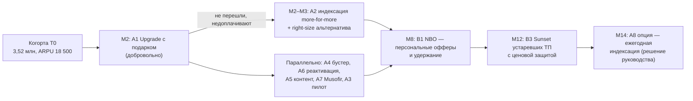

# 03. Портфель инициатив: EASY vs HARD

> Все инициативы касаются **только абонентов архивных тарифов** (когорта T0). Разделение — по сложности
> для **биллинга и интеграций**: EASY = настройка существующих возможностей (параметры ТП, пакеты, USSD/SMS,
> CRM-кампании), 2–6 недель; HARD = новая функциональность биллинга, внешние интеграции, ML-платформы, 6–12 мес.
>
> Цифры — Монте-Карло, 20 000 прогонов, **P50 (P10…P90)**, млрд сум без НДС.
> «Шанс успеха» = P(окупится за 24 мес. и поднимет ARPU) × P(запуск как задумано). Методика — [05](05_success_probability.md).

## Сводка

| # | Инициатива | Группа | Сложн. | Старт | Выручка Y1 | Вклад 24 мес | ΔARPU когорты | Шанс успеха | Решение |
|---|---|---|---|---|---|---|---|---|---|
| **A2** | Точечная индексация недооценённых архивных ТП (more-for-more) | EASY | 1 | M2 | **24,4** (19,5…29,6) | **39,6** | **+4,4%** | **80%** | ✅ Волна 1 (пилот 10% → масштаб) |
| **A1** | «Ucell 30 — Upgrade»: мягкая миграция с подарком | EASY | 1 | M2 | 7,3 (4,2…11,7) | 11,8 | +1,4% | **92%** | ✅ Волна 1 |
| A4 | Бустер-пакет в момент исчерпания (opt-in) | EASY | 2 | M2 | 2,5 | 3,3 | +0,4% | 90% | ✅ Волна 1 |
| A6 | Реактивация спящих архивных SIM | EASY | 1 | M2 | 1,2 | 1,0 | +0,1% | 92% | ✅ Волна 1 |
| A7 | «Musofir»: роуминг/OTP для мигрантов | EASY | 2 | M3 | 1,4 | 1,5 | +0,3% | 90% | ✅ Волна 2 |
| A5 | Контент-надстройка (Yandex Plus / OVVA / Ucell TV) | EASY | 2 | M3 | 2,2 | 1,0 | +0,5% | 85% | ✅ Волна 2 (ради удержания) |
| A3 | PAYG → суточные/недельные микропакеты | EASY | 2 | M2 | 1,4 (0,1…2,8) | 1,4 (−0,9…3,7) | +0,2% | 70% | 🧪 Только пилот, масштаб по A/B |
| A8 | **Опция:** ежегодная индексация архива на инфляцию (волна 2) | EASY | 1 | M14 | — | 15,2 | +3,8% | 65% | ⏸ Решение руководства в M12 |
| **B3** | Sunset устаревших семейств ТП с ценовой защитой | HARD | 5 | M12 | 3,8 | **31,5** (16,6…50,3) | **+7,9%** | **60%** | ✅ Волна 3 |
| **B1** | AI Next-Best-Offer (RTD/CVM) | HARD | 4 | M8 | 6,7 | 14,2 (5,2…24,5) | +3,2% | **64%** | ✅ Волна 3 (платформа) |
| B2 | «Ucell Oila»: семейный аккаунт | HARD | 4 | M9 | 1,4 | 0,0 (−2,6…3,4) | +0,9% | 33% | 🔶 Стратегическая ставка, только после пилота |
| B5 | Персональные лимиты «Mobil avans» (ML-скоринг) | HARD | 3 | M6 | 1,7 | 0,0 (−1,5…1,8) | +0,5% | 34% | 🔶 Условно: при бюджете ≤1,5 млрд |
| B4 | 2G/3G → 4G-смартфон в рассрочку (BNPL) | HARD | 4 | M7 | 0,2 | **−3,0** | +0,1% | **0%** | ❌ Не делаем (см. карточку) |

**Портфель (все ✅ и 🔶, с учётом вероятности запуска и перекрытия):** ARPU когорты **+11,5% (6,1…16,9%)**
к месяцу 24, выручка **+36,7 млрд сум в Y1** и **+64,6 млрд в Y2**, run-rate **≈ $5,1 млн/год**;
P(≥10%) = 61%, P(≥15%) = 22%. Со Stretch-опцией A8: **+13,4%**, P(≥15%) = 38%.
Если всё запустится по плану (без поправки на риск исполнения) — **+15,8%**. Подробно — [04](04_unit_economics.md).

### Приоритизация (ценность × уверенность / усилие)

| # | Вклад 24м P50 | Шанс | Сложность | Скор = вклад × шанс / сложность | Ранг |
|---|---|---|---|---|---|
| A2 | 39,6 | 0,80 | 1 | **31,7** | 1 |
| A1 | 11,8 | 0,92 | 1 | **10,9** | 2 |
| A8 | 15,2 | 0,65 | 1 | 9,9 | 3 (опция) |
| B3 | 31,5 | 0,60 | 5 | 3,8 | 4 |
| B1 | 14,2 | 0,64 | 4 | 2,3 | 5 |
| A4 | 3,3 | 0,90 | 2 | 1,5 | 6 |
| A6 | 1,0 | 0,92 | 1 | 0,9 | 7 |
| A7 | 1,5 | 0,90 | 2 | 0,7 | 8 |
| A3 | 1,4 | 0,70 | 2 | 0,5 | 9 |
| A5 | 1,0 | 0,85 | 2 | 0,4 | 10 |
| B2 | 0,0 | 0,33 | 4 | 0,0 | 11 |
| B5 | 0,0 | 0,34 | 3 | 0,0 | 12 |
| B4 | −3,0 | 0,00 | 4 | < 0 | 13 |

Честный вывод: **80% эффекта дают 4 инициативы — A2, A1, B3, B1** (+ опция A8). Остальные — небольшие по
деньгам, но нужны для удержания (A5, A7), для «пряника» в коммуникации (A4, A6) и для доли рынка (B2).

---

# ГРУППА EASY (биллинг: настройка, без разработки ядра)

## A2. Точечная индексация недооценённых архивных ТП (more-for-more) — ⭐ главный рычаг

**Сегмент:** S3 — архивные пакеты, где абонплата ниже актуальной линейки при сопоставимом потреблении;
без ТП февральской волны 2026 и **без соцгруппы (ж 55+, м 60+)**. Целевая группа ≈ 22% когорты (~775 тыс.).

**Механика.**
1. Value-gap анализ 🟨: для каждого архивного ТП — фактическое потребление vs ближайший актуальный ТП.
2. Повышение абонплаты на **+4 000…6 000 сум (≈ +15–20%)** с добавлением ГБ (more-for-more)
   **и** предложением «right-size»: если ГБ не нужны — бесплатный переход на ТП дешевле (снимает боль «платим за ГБ, которые не используем»).
3. Уведомление ≥15 дней (SMS + push + сайт), в тексте — сумма в сумах, дата, что добавлено, как бесплатно сменить ТП.
4. Пилот на 10% целевой группы (стратифицированный A/B, holdout) → через 6–8 недель решение о масштабе.

**Почему EASY:** изменение цены/объёма существующего ТП = параметр продуктового каталога; массовая рассылка — стандартная CRM-кампания.

**Бенчмарки:** Россия (+10% в 2022, +15–20% у T2 в 2026), AT&T (+$6), T-Mobile (+$5, двухэтапно),
Индия (+10–25%), Казахстан (5% тарифов), сам Ucell 02/2026 (+5 000 сум). **Сработало во всех кейсах по выручке.**

**Параметры модели:** даунгрейд 4–15%, доп. отток 1–5% (мода 2,5%), себестоимость доп. ГБ 200–800 сум/мес.

**Результат модели:** выручка Y1 **24,4 млрд** (19,5…29,6), вклад 24м **39,6 млрд**, ROI 5,7×, ΔARPU **+4,4%**.
Цена: −15 тыс. абонентов (−0,04 п.п. доли) — компенсируем B1/A5/A7.
**Шанс успеха 80%** (главный риск — регуляторный/репутационный, не экономический).

**KPI:** ΔARPU группы vs holdout; доля даунгрейдов; отток 30/60/90 дней vs holdout.
**Guardrails / kill:** отток тестовой группы > holdout + 1,5 п.п. за 60 дней **или** жалобы в регулятор > 2× нормы → откат/пересмотр.

## A1. «Ucell 30 — Upgrade»: мягкая миграция с подарком

**Сегмент:** S3 + половина S4 + смартфонная часть S2 (~46% когорты).
**Механика.** Персональное предложение перейти на актуальный ТП (Foydali / Doimiy / BOR) с подарком за
лояльность в год **30-летия Ucell**: например, +50% ГБ на 3 месяца или «первый месяц со скидкой 50%».
Каналы: USSD-меню, Ucell app (сравнение «ваш ТП vs новый» в сумах), SMS, IVR, офисы.
Запускается **за 2–4 недели до A2** — «пряник» перед «кнутом».

**Почему EASY:** тарифы и бонусные пакеты уже существуют; нужна CRM-кампания и промокод/бонус.
**Бенчмарки:** Telenor Norway (ARPU +4% за счёт миграции), ближневосточный оператор (10% базы за 3 мес.,
ARPU мигрантов +55%), T-Mobile (перевод с grandfathered-планов). **Сработало.**
**Результат:** Y1 7,3 млрд, вклад 11,8 млрд, ROI 7,2×, ΔARPU +1,4%. **Шанс 92%**.
**Ключевые драйверы** (tornado): прирост ARPU на мигранта и конверсия — поэтому тестируем 3 варианта подарка.
**KPI:** конверсия в переход, ΔARPU мигранта через 3 мес., доля «возвратов» на старый ТП.
**Kill:** конверсия < 3% в пилоте при любом варианте подарка.

## A4. Бустер-пакет в момент исчерпания (opt-in автопродление)

**Сегмент:** S3/S4, исчерпывающие пакет до конца периода (~15% когорты).
**Механика.** Триггер «осталось 20% / 0% ГБ» → USSD/SMS/push: «Докупить 5 ГБ за X сум?» + опция
«включить автопродление бустера» (**только явное согласие**, отключение одной командой).
**Почему EASY:** пороговые уведомления и доп. пакеты есть в биллинге; нужен сценарий кампании.
**Бенчмарки:** контекстные офферы Flytxt (+8% ARPU), бустеры Jio/Airtel, автопродление у операторов РФ. **Сработало.**
**Результат:** Y1 2,5 млрд, вклад 3,3 млрд, ROI 3,5×, **шанс 90%**. Каннибализация (тех, кто и так докупает) — 30–60%, учтена.

## A6. Реактивация спящих архивных SIM

**Сегмент:** S1 (~20% когорты, ARPU ~3 000 сум). Часто — «номер для банковских SMS».
**Механика.** Win-back оффер: «Вернитесь: 5 ГБ за 5 000 сум на 30 дней», сегментация по давности последней активности.
**Почему EASY:** стандартная кампания + существующий пакет.
**Бенчмарки:** Flytxt (+8% ARPU при реактивации неактивных). **Сработало.**
**Результат:** вклад 1,0 млрд, **шанс 92%**; эффект затухает (через 6 мес. активны 50–80% реактивированных).

## A7. «Musofir»: пакеты роуминга и OTP для трудовых мигрантов

**Сегмент:** архивные абоненты с роумингом/международными звонками за 12 мес. (~6% когорты).
**Механика.** Пакет «Musofir»: SMS/OTP банков + мессенджеры + минуты домой, в РФ/КЗ/Корее/Турции; подключение
до выезда (триггер: покупка авиабилета не видна → триггер «первая регистрация в сети роуминг-партнёра»).
Ценность: номер Ucell остаётся «банковским» и «семейным» на время работы за границей.
**Почему EASY:** роуминговые пакеты уже есть (BOR 50/70/90 включают ГБ в СНГ) — нужна упаковка и триггер.
**Контекст:** переводы $18,9 млрд в 2025, ~1,3 млн граждан работают в РФ.
**Результат:** вклад 1,5 млрд, ROI 3,7×, **шанс 90%**; снижает отток в сегменте.

## A5. Контент-надстройка для архивных ТП

**Сегмент:** смартфонные S3/S4 (~35% когорты).
**Механика.** Добавить к архивному ТП подписку (Yandex Plus / OVVA / Ucell TV) со скидкой через
существующий carrier billing; бесплатный первый месяц → оплата.
**Почему EASY:** интеграция с Yandex Plus уже есть (включён в BOR 90); нужно партнёрское согласие на архивный канал.
**Бенчмарки:** VEON / Beeline UZ multiplay (ARPU ×3,7, отток ÷2,2 — с поправкой на самоотбор). **Сработало.**
**Результат:** деньги небольшие (вклад 1,0 млрд, маржа оператора ~30%), **но главный эффект — удержание**
(отток адоптеров −15…40%). **Шанс 85%**.

## A3. PAYG → суточные/недельные микропакеты (только пилот)

**Сегмент:** S2 — поминутная тарификация, регионы (~20% когорты).
**Механика.** Добровольные суточные пакеты «плати только в день использования» (например, 1 500 сум/сутки
за 1 ГБ + минуты внутри сети). **Без** обязательного минимума (запрещено логикой правил 2026 и опытом Индии).
**Риск:** часть «тяжёлых» PAYG станет платить **меньше** (ΔARPU −1 500…+5 500) → P(вклад>0) = 78%.
**Решение:** пилот на 10–20 тыс. абонентов; масштабируем, только если ΔARPU vs holdout > 0 статистически значимо.
**Шанс 70%**.

## A8. ОПЦИЯ: ежегодная индексация архива на инфляцию (волна 2, M14)

**Механика.** Через ~12 мес. после A2 — индексация архивных пакетов на ~инфляцию (+1 500…2 500 сум),
объявленная заранее (урок Ofcom), с бесплатной альтернативой и исключением соцгруппы.
**Результат:** вклад 15,2 млрд, ΔARPU +3,8% к M24. **Шанс 65%** — ниже из-за регуляторного риска
(Комитет по конкуренции). **Решение принимает руководство в M12 по итогам A2 и регуляторного фона.**

---

# ГРУППА HARD (новая функциональность биллинга, интеграции, платформы)

## B3. Sunset-программа: вывод устаревших семейств ТП с ценовой защитой — ⭐ второй по силе рычаг

**Сегмент:** наиболее устаревшие семейства архивных ТП (~25% когорты), не охваченные A1/A2.
**Механика.**
1. Каталог архивных ТП → кластеры «закрыть / оставить». Для каждого закрываемого ТП — mapping на
   **ближайший по ценности** актуальный ТП.
2. Предложение перейти с бонусом (как A1) за 60 дней до закрытия.
3. Для не выбравших — автоматический перевод на mapped-ТП с **ценовой защитой 3 месяца** (старая цена),
   уведомление ≥15 дней и бесплатная смена на любой другой ТП.
4. Соцгруппа — перевод без повышения цены.

**Почему HARD:** массовая миграция сотен тысяч абонентов, чистка тарифных кодов, пересчёт остатков пакетов,
перенастройка IVR/CRM/биллинга, нагрузка на контакт-центр, юр. проверка процедуры закрытия ТП.
**Бенчмарки:** T-Mobile (grandfathered → новые планы), Airtel (вывод низкодоходных планов), TPG (упрощение портфеля),
Telenor (выравнивание тарифов). **Сработало**; риск — исполнение.
**Результат:** выручка Y1 3,8 млрд (старт в M12), **run-rate 35,3 млрд/год**, вклад 24м **31,5 млрд** (16,6…50,3),
ΔARPU **+7,9%**, экономия OPEX на поддержке каталога. Цена: −31 тыс. абонентов (−0,09 п.п.).
**Шанс 60%** (ограничитель — P(запуска) 60%).
**Бюджет:** 4–10 млрд сум разово (мода 6 млрд ≈ $0,5 млн).

## B1. AI Next-Best-Offer (real-time decisioning / CVM)

**Сегмент:** вся архивная когорта (платформа масштабируется на всю базу позже).
**Механика.** Модели propensity/uplift по каждому офферу (A1, A4, A5, A7, retention), выбор лучшего действия
в реальном времени (событие: исчерпание, пополнение, роуминг, падение активности, риск оттока),
единый контактный календарь (ограничение частоты).
**Почему HARD:** RTD-платформа, стриминг событий из биллинга/OCS, feature store, интеграция каналов (USSD, app, SMS),
MLOps; требования закона о персональных данных (хранение и обработка в РУз).
**Бенчмарки:** Flytxt (+8,2%), fonYou (+22%), Acxiom (+2%/год, отток −15%), Telefónica Argentina.
Beeline UZ уже внедряет predictive AI — **это вопрос паритета с конкурентом**.
**Результат:** Y1 6,7 млрд (старт M8), **run-rate 25 млрд/год**, вклад 24м 14,2 млрд, ΔARPU +3,2%,
**+31 тыс. удержанных абонентов (+0,09 п.п. доли)** — единственная крупная инициатива, растящая долю.
**Шанс 64%.** Бюджет: 6–14 млрд сум разово + ~150 млн/мес.

## B2. «Ucell Oila»: семейный/групповой аккаунт (стратегическая ставка)

**Сегмент:** плательщики S3/S4 с домохозяйством (несколько SIM на паспорт/адрес, частые звонки между номерами).
**Механика.** Групповой ТП с общим пакетом на 2–5 SIM, один счёт, добавление членов семьи из других сетей (MNP).
**Почему HARD:** иерархия счетов, общий пакет, управление участниками в app, MNP-воронка.
**Бенчмарки:** Beeline UZ Oila (12/2024), T-Mobile/AT&T family, Beeline RU. Отток ↓, ARPA ↑, ARPU на линию ↓.
**Результат:** за 24 мес. вклад ≈ 0 (−2,6…3,4) из-за разработки, **но run-rate 6,4 млрд/год** и +8,8 тыс. абонентов (+0,02 п.п.).
**Шанс 33%.** **Решение:** не запускать до пилота на существующем механизме «1+1» (проверить спрос дёшево);
если конверсия пилота ≥ 4% — разработка.

## B5. Персональные лимиты «Mobil avans» на ML-скоринге

**Сегмент:** архивные абоненты, регулярно уходящие в ноль (~30% когорты).
**Механика.** Скоринг (стаж, пополнения, стабильность) → персональный лимит аванса и предложение в момент нулевого баланса.
**Почему HARD:** модель скоринга, интеграция лимитов с биллингом, контроль невозврата, юр. рамка (не кредит).
**Бенчмарки:** Vodacom/MTN (до 42–48% пополнений); регуляторные запреты в Нигерии.
**Результат:** вклад ≈ 0 (−1,5…1,8), **шанс 34%**. **Решение:** делать только если стоимость ≤ 1,5 млрд сум (например, скоринг
на существующей DWH, без новой платформы) — тогда вклад положительный.

## B4. Апгрейд 2G/3G → 4G-смартфон в рассрочку — ❌ не рекомендую

**Идея:** владельцам кнопочных телефонов (S2) — смартфон в рассрочку через BNPL-партнёра + пакет.
**Результат модели:** вклад 24м **−3,0 млрд**, шанс **0%**; даже при партнёрской модели (интеграцию платит партнёр,
без субсидии) — вклад ≈ 0 (шанс ~24%). Малая целевая группа (~8% когорты), высокая каннибализация (многие купят смартфон сами).
**Решение:** в бэклог. Пересмотреть, если данные D9 покажут долю 2G/3G-устройств в когорте > 15% или вендор/банк
возьмёт на себя всю интеграцию.

---

## Как инициативы работают вместе (последовательность «пряник → кнут → платформа»)

