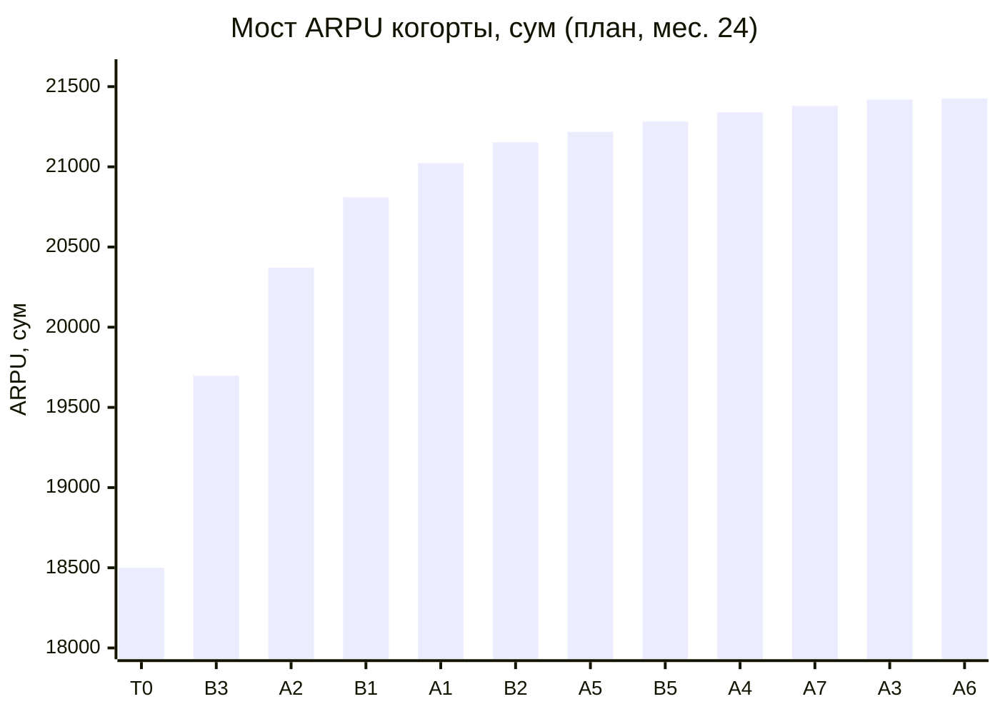

# 04. Unit-экономика и финансовый эффект

> Источник цифр: `model/arpu_model.py` (Монте-Карло) и `model/Ucell_Archive_ARPU_Model.xlsx` (формулы,
> совпадают с детерминированным прогоном Python). Все суммы — **сум без НДС**; 1 USD ≈ 12 100 сум.
> Базовые значения — гипотезы до получения данных (🟨 [09](09_data_request_for_analysts.md)).

## 1. Экономика архивной когорты (база)

| Показатель | Значение | Комментарий |
|---|---|---|
| Абоненты Ucell | 11,0 млн | факт, начало 2026 |
| Доля на архивных ТП | 40% | HYPOTHESIS |
| Доля активных | 80% | HYPOTHESIS |
| **Активная архивная когорта** | **3,52 млн** | |
| **ARPU когорты (net)** | **18 500 сум** (~$1,53) | средневзвешенно по S1–S5 |
| Выручка когорты | 65,1 млрд/мес · **781 млрд/год (~$65 млн)** | |
| Месячный отток | 1,5% | HYPOTHESIS |

Чувствительность к базе: каждые ±10% размера когорты меняют абсолютный эффект пропорционально,
но **не меняют ΔARPU в %** и почти не меняют шанс успеха — поэтому вывод «делать / не делать»
устойчив к неточности гипотез.

## 2. Unit-экономика по инициативам (модальные значения)

### Добровольные (adoption): экономика одного инкрементального адоптера

| # | Целевая группа | Инкр. адоптеров | Конверсия контакта | Привлечение на адоптера* | Фикс. затраты на адоптера | Маржа/мес на адоптера | Окупаемость | LTV 24м | LTV / CAC |
|---|---|---|---|---|---|---|---|---|---|
| A1 | 1 619 тыс. | 132 тыс. | 9,6% | 3 562 | 3 027 | 5 525 | **1,2 мес.** | 113 915 | **17,3** |
| A3 | 704 тыс. | 68 тыс. | 12,0% | 1 750 | 3 699 | 1 825 | 3,4 мес. | 37 319 | 6,8 |
| A4 | 528 тыс. | 31 тыс. | 6,6% | 758 | 11 160 | 5 875 | 2,1 мес. | 120 137 | 10,1 |
| A5 | 1 232 тыс. | 20 тыс. | 2,0% | 7 500 | 10 146 | 3 600 | 5,7 мес. | 76 092 | 4,3 |
| A6 | 704 тыс. | 24 тыс. | 4,8% | 6 125 | 6 341 | 5 950 | 2,3 мес. | 62 601 | 5,0 |
| A7 | 211 тыс. | 23 тыс. | 13,5% | 1 111 | 6 576 | 4 200 | 2,0 мес. | 88 040 | 11,5 |
| B2 | 704 тыс. | 20 тыс. групп | 3,6% | 14 167 | 246 607 | 21 280 | 13,9 мес. | 453 548 | 1,7 |
| B5 | 1 056 тыс. | 86 тыс. | 9,0% | 556 | 29 227 | 2 100 | 18,2 мес. | 43 298 | 1,5 |
| B4 | 282 тыс. | 6 тыс. | 3,2% | 56 154 | 390 235 | 7 700 | **306 мес.** | 161 407 | **0,4** ❌ |

\* стоимость контактов / адоптеров + разовый подарок/стимул. Инкрементальность = конверсия × (1 − каннибализация).
«Маржа/мес» = ΔARPU × маржинальность − переменные затраты. LTV учитывает отток адоптеров и затухание (A6).

### Изменение условий (reprice): экономика на одного затронутого абонента

| # | Затронуто | Остаются и платят | Повышение net | Чистый эффект / затронутого / мес** | Разовые затраты / затронутого | Окупаемость | **Точка безубыточности по оттоку** |
|---|---|---|---|---|---|---|---|
| A2 | 774 тыс. | 693 тыс. | 4 464 | **2 873** | 487 | **5 дней** | отток может вырасти до **13,3%** группы |
| B3 | 880 тыс. | 757 тыс. | 5 804 | 3 761 | 7 018 | 1,9 мес. | до **21,0%** |
| A8 | 1 338 тыс. | 1 271 тыс. | 1 786 | 1 241 | 212 | 5 дней | до **5,1%** |

\** после даунгрейдов, доп. оттока и себестоимости доп. ГБ.

**Главный аргумент для руководства по A2:** в модели заложен доп. отток 2,5% (диапазон 1–5%), а инициатива
остаётся прибыльной, пока отток не превысит **13,3%** целевой группы — это в 5 раз больше худших бенчмарков
(AT&T, T-Mobile — десятые доли п.п.; Индия-2024 — ~2% базы Jio).

### Платформа (relative)

| # | Эффект на абонента когорты | Разовые затраты на абонента | Окупаемость после запуска |
|---|---|---|---|
| B1 | +429 сум/мес маржи (ARPU +3% × 85% − OPEX) | 2 557 сум | ~6 мес. |

## 3. P&L программы

### План (все рекомендуемые инициативы запущены по графику, перекрытие 20%)

| млрд сум | Y1 (мес. 1–12) | Y2 (мес. 13–24) | Итого 24 мес. |
|---|---|---|---|
| Инкрементальная выручка (после перекрытия) | **43,6** | **89,8** | 133,4 |
| Затраты (разовые + OPEX + переменные) | 31,8 | 10,9 | 42,7 |
| Вклад = маржа × (1 − перекрытие) − затраты | 7,5 | 71,1 | **78,7** |
| Run-rate выручки на мес. 24 | | | **85,0 / год (≈ $7,0 млн)** |
| ΔARPU когорты на мес. 24 | +15,7% (мес. 12) | **+15,8%** | ARPU 18 500 → **21 421 сум** |

### С поправкой на риск (Монте-Карло: каждая инициатива запускается с вероятностью P(запуска))

| Показатель | P10 | **P50** | P90 |
|---|---|---|---|
| Выручка Y1, млрд | 19,4 | **36,7** | 46,5 |
| Выручка Y2, млрд | 35,9 | **64,6** | 95,2 |
| Run-rate на мес. 24, млрд/год | 34,1 | **61,3 (≈ $5,1 млн)** | 90,3 |
| Вклад 24 мес., млрд | 23,4 | **53,0** | 84,9 |
| ΔARPU когорты, мес. 24 | +6,1% | **+11,5%** | +16,9% |
| ARPU когорты, мес. 24, сум | 19 628 | **20 627** | 21 633 |
| Δ доли рынка, п.п. | −0,08 | **0,00** | +0,08 |

P(вклад > 0) = **99%**; P(ΔARPU ≥ 5%) = 95%; **P(≥ 10%) = 61%**; P(≥ 15%) = 22%.

Только EASY: ΔARPU +5,5% (2,2…6,7%), вклад 41,8 млрд (P(>0) = 100%).
Только HARD: ΔARPU +6,7% (1,1…11,2%), вклад 13,5 млрд (−9,9…39,5; P(>0) = 77%) — HARD окупаются во 2-м году.

### Stretch (+ A8 ежегодная индексация в M14)

ΔARPU **+13,4%** (7,6…19,4%), run-rate ≈ **$5,8 млн/год**, вклад 60,4 млрд; P(≥ 10%) = 75%, P(≥ 15%) = 38%.

## 4. Мост ARPU: 18 500 → ~21 400 сум (план, мес. 24, после перекрытия 20%)

| Шаг | + сум | ARPU после шага |
|---|---|---|
| База T0 | | 18 500 |
| B3 Sunset + ценовая защита | +1 197 | 19 697 |
| A2 Индексация more-for-more | +674 | 20 371 |
| B1 AI NBO | +439 | 20 810 |
| A1 Upgrade с подарком | +213 | 21 023 |
| B2 Семейный аккаунт | +130 | 21 153 |
| A5 Контент | +65 | 21 218 |
| B5 Mobil avans | +64 | 21 282 |
| A4 Бустер | +58 | 21 340 |
| A7 Musofir | +40 | 21 380 |
| A3 Микропакеты | +39 | 21 419 |
| A6 Реактивация | +9 | **~21 426** (+15,8%) |
| *Опция A8* | *+574* | *~22 000 (+19%)* |

## 5. Инвестиции

| Блок | Разовые (мода), млрд сум | OPEX, млн сум/мес | ≈ USD разово |
|---|---|---|---|
| EASY A1–A7 | 1,8 | 105 | $0,15 млн |
| B1 AI NBO | 9,0 (6–14) | 150 | $0,74 млн |
| B3 Sunset | 6,0 (4–10) | 30 | $0,50 млн |
| B2 Семья (условно) | 5,0 (3–8) | 50 | $0,41 млн |
| B5 Mobil avans (условно) | 2,5 (1,5–4) | 40 | $0,21 млн |
| **Итого рекомендуемый портфель** | **24,3** | **375** | **≈ $2,0 млн** |
| Без условных B2/B5 (до пилотов) | 16,8 | 285 | ≈ $1,4 млн |

**Самофинансирование:** EASY-волна приносит ~30 млрд сум выручки в Y1 при затратах ~7 млрд — этого
хватает, чтобы профинансировать разработку B1 и B3 из эффекта первой волны.

## 6. Чувствительность (tornado, вклад 24 мес.)

| Инициатива | Параметр №1 | Параметр №2 | Параметр №3 |
|---|---|---|---|
| A1 (база 11,9) | ΔARPU мигранта: 4,5 … 21,3 | Конверсия: 4,8 … 21,2 | Каннибализация: 13,6 … 9,2 |
| A2 (база 42,9) | Размер повышения: 30,7 … 55,0 | Размер группы: 34,9 … 50,8 | Доп. отток: 48,5 … 33,5 |
| B1 (база 12,5) | Прирост ARPU от NBO: −0,9 … 32,5 | Стоимость платформы: 15,5 … 7,5 | Снижение оттока: 10,1 … 16,5 |

**Что это значит для пилотов:** для A1 тестируем варианты подарка (драйвер конверсии и ΔARPU);
для A2 — 2 уровня повышения (+4 000 / +6 000) и замеряем отток; для B1 — начинать с MVP на
2–3 офферах и доказывать uplift на holdout до закупки полной платформы (риск B1 — в эффекте, а не в затратах).

## 7. Допущения, которые сильнее всего нужно проверить данными

1. Доля и ARPU архивной когорты (D1, D2) — масштаб всего эффекта.
2. Эластичность оттока к повышению — по февральской волне 2026 (D7) — ключ к A2/B3/A8.
3. Value-gap: сколько абонентов S3 реально недоплачивают относительно ближайшего актуального ТП (D3).
4. Доля исчерпывающих пакет и частота докупки (D5) — A4.
5. Доля 2G/3G-устройств (D9) — окончательное решение по B4.
