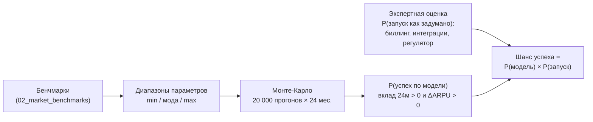

# 05. Шансы на успех: как «протестировали» каждую идею

> Требование: «если практика была — примерно протестируй и покажи в %, каковы шансы на успех».
> Сделано в три слоя: (1) доказательства из других стран → (2) диапазоны параметров → (3) Монте-Карло
> на 20 000 сценариев с поправкой на вероятность исполнения. Код: `model/arpu_model.py`.

## 1. Методика

1. **Параметры** каждой инициативы (охват, конверсия, каннибализация, ΔARPU, доп. отток, даунгрейд, затраты)
   заданы треугольными распределениями, откалиброванными по аналогам. Где кейсы вендорские/консалтинговые
   (возможен отбор лучших), диапазон сдвинут вниз (например, NBO: +1…6% вместо заявленных +8…22%).
2. **Монте-Карло**: 20 000 случайных сочетаний параметров; для каждого — помесячная симуляция 24 мес.
   (набор адоптеров, отток, удержание, затраты), расчёт вклада и ARPU **когорты**.
3. **Критерий успеха (основной)**: инициатива окупилась за 24 мес. (вклад > 0) **и** подняла ARPU когорты
   через 12 мес. после запуска.
4. **Строгий критерий «бизнес-кейс»**: вклад ≥ 70% плана **и** ΔARPU ≥ 70% плана (план — расчёт на модах).
5. **P(запуска)** — вероятность, что инициатива будет запущена в срок и в задуманном виде
   (сложность биллинга, интеграции, регуляторика, решение руководства).

## 2. Результаты

| # | Инициатива | Сила доказательств (1–5) | Аналоги | P(вклад>0) | P(успех по модели) | P(запуска) | **Шанс успеха** | Шанс ≥70% бизнес-кейса |
|---|---|---|---|---|---|---|---|---|
| A1 | «Ucell 30 — Upgrade»: мягкая миграция с подарком | 4 | Telenor NO, ближневост. оператор, T-Mobile, консалт-кейсы | 100% | 100% | 92% | **92%** | 71% |
| A2 | Точечная индексация недооценённых архивных ТП (more-for-more) | 5 | РФ ×4 оператора, AT&T, T-Mobile, Индия, Казахстан, Ucell 02/2026 | 100% | 100% | 80% | **80%** | 72% |
| A3 | PAYG → суточные/недельные микропакеты | 3 | Индия 2018–19 (жёсткий вариант), суточные пакеты в РФ/Индии | 78% | 78% | 90% | **70%** | 49% |
| A4 | Бустер-пакет в момент исчерпания (opt-in автопродление) | 3 | Flytxt, бустеры Jio/Airtel, автопродление РФ | 100% | 100% | 90% | **90%** | 77% |
| A5 | Контент-надстройка (Yandex Plus / OVVA / Ucell TV) | 4 | VEON, Beeline UZ, Ucell BOR 90 | 100% | 100% | 85% | **85%** | 68% |
| A6 | Реактивация спящих архивных SIM | 3 | Flytxt (реактивация) | 100% | 100% | 92% | **92%** | 71% |
| A7 | «Musofir»: роуминг/OTP для мигрантов | 3 | Тарифы «для гостей» РФ/КЗ, Flytxt | 100% | 100% | 90% | **90%** | 70% |
| A8 | ОПЦИЯ: ежегодная индексация (волна 2) | 4 | РФ (ежегодно), UK (до/после Ofcom 2025) | 100% | 100% | 65% | **65%** | 57% |
| B1 | AI Next-Best-Offer (RTD/CVM) | 3 | Flytxt, fonYou, Acxiom, Telefónica AR (вендорские) | 99% | 99% | 65% | **64%** | 50% |
| B2 | «Ucell Oila»: семейный аккаунт | 3 | Beeline UZ Oila, T-Mobile/AT&T, Beeline RU | 51% | 51% | 65% | **33%** | 33% |
| B3 | Sunset устаревших ТП с ценовой защитой | 4 | T-Mobile, Airtel, TPG, Telenor | 100% | 100% | 60% | **60%** | 44% |
| B4 | 2G/3G → 4G-смартфон в рассрочку | 2 | VEON, Airtel (без публичной экономики) | 0% | 0% | 60% | **0%** | 0% |
| B5 | Персональные лимиты «Mobil avans» | 3 | Vodacom, MTN (+регуляторные запреты) | 49% | 49% | 70% | **34%** | 34% |

**Как читать:** у EASY-инициатив экономика устойчива (вклад > 0 почти во всех сценариях), и шанс
определяется исполнением/регулятором. У HARD — наоборот: B2 и B5 окупаются только в половине сценариев за 24 мес.,
а B4 не окупается ни в одном — поэтому B4 исключена, а B2/B5 идут через дешёвый пилот.

## 3. Портфель: вероятность достичь цели по ARPU

| Сценарий | ΔARPU мес. 24, P50 (P10…P90) | P(≥5%) | P(≥10%) | P(≥15%) | P(≥20%) |
|---|---|---|---|---|---|
| Только EASY | +5,5% (2,2…6,7%) | 66% | 0% | 0% | 0% |
| Только HARD | +6,7% (1,1…11,2%) | 59% | 19% | 0% | 0% |
| **Базовый (рекомендуемый)** | **+11,5% (6,1…16,9%)** | **95%** | **61%** | **22%** | 1% |
| Stretch (+A8) | +13,4% (7,6…19,4%) | 98% | 75% | 38% | 7% |
| План без рисков исполнения | +15,8% | — | — | — | — |

**Вывод для защиты:** цель «+10% ARPU архивной когорты за 24 мес.» достигается с вероятностью **61%**
(базовый портфель) или **75%** (с опцией A8). Обещать руководству +15% — значит обещать то, что случится
лишь в каждом 3–5-м сценарии; рекомендую коммитить **+10%** и держать +15% как stretch.

## 4. Обоснование P(запуска)

| # | P(запуска) | Почему |
|---|---|---|
| A1, A6 | 92% | Только CRM-кампания на существующих ТП и пакетах |
| A3, A4, A7 | 90% | Настройка пакетов/триггеров; нужны сценарии согласия (A4) |
| A5 | 85% | Нужно согласие партнёра (Yandex/OVVA) на канал архивной базы |
| A2 | 80% | Технически тривиально; риск — регулятор (запрос Комитета по конкуренции 11/2025) и решение руководства |
| B5 | 70% | Скоринг на DWH реален, но юр. рамка «аванс ≠ кредит» и невозврат |
| B1, B2 | 65% | Закупка/разработка платформы, интеграция с OCS/биллингом, локализация персональных данных |
| A8 | 65% | Вторая ценовая волна за ~12 мес. — высокая регуляторная чувствительность |
| B3, B4 | 60% | Массовая миграция/закрытие ТП или внешний партнёр + логистика устройств |

## 5. Ограничения метода (честно)

1. **Диапазоны — экспертные**, откалиброваны по внешним кейсам; реальные данные Ucell могут их сдвинуть.
   Поэтому шаг 🟨 D7 (анализ февральской волны 2026) — критичный: это локальная калибровка эластичности.
2. **Параметры независимы** в модели; в реальности, например, высокий отток и высокий даунгрейд коррелируют
   (оба растут при негативном PR). Это делает хвосты немного оптимистичнее реальности.
3. **Реакция конкурентов не моделируется** (например, агрессивные офферы Mobiuz после приватизации или Beeline).
4. **База без инициатив принята стабильной** (ARPU когорты не растёт сам): эффект — строго инкрементальный.
5. **Публикационный сдвиг** в кейсах вендоров учтён понижением диапазонов, но не устранён полностью.

## 6. Как обновлять шансы после пилотов (Data-Driven)

После каждого пилота заменяем экспертный диапазон на **наблюдённый** (например, конверсия A1 в пилоте 8,5% ± 1,2 п.п.
→ треугольник 6%…8,5%…11%), перезапускаем `python model/arpu_model.py` — вероятность пересчитывается.
Правило остановки: если после пилота шанс успеха инициативы < 50% — инициатива уходит на переработку или закрывается.
