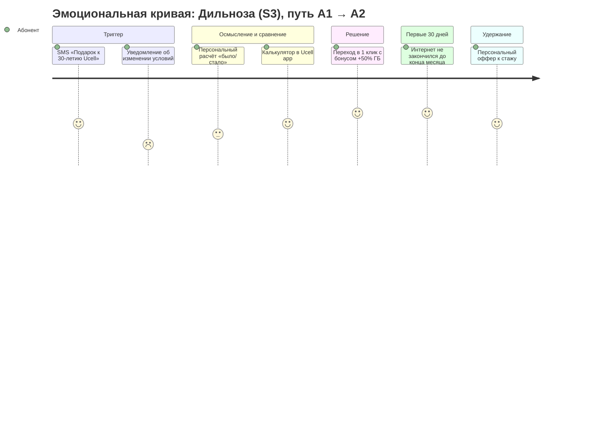

# 06. Customer Journey Map (CJM) архивного абонента

> CJM построены на гипотезах Discovery; после 12–15 интервью (🟨 [01](01_discovery.md), п. 7) уточнить эмоции и боли
> цитатами абонентов.

## 1. Персоны

| Персона | Сегмент | Профиль | Цель | Главная боль | Что ему предлагаем |
|---|---|---|---|---|---|
| **Дильноза, 34, Ташкент** | S3 | 9 лет на «старом пакете», смартфон, Instagram/Telegram, платит 18–22 тыс. | Хватает интернета, без лишних трат | Интернет заканчивается к 20-му числу; раздражают «повышения» | A1 Upgrade с подарком → A4 бустер |
| **Рустам-ака, 52, Фергана** | S2 | Кнопочный + старый смартфон у сына, PAYG, звонки | Звонить родным, не думать о балансе | Баланс уходит в ноль, номер «отключают» | A3 суточный пакет, B5 персональный аванс |
| **Азиз, 27, в Москве** | Мигрант (S3/S1) | Номер Ucell для банка и семьи, в РФ местная SIM | Получать SMS банков, связь с мамой | Дорогой роуминг, боится потерять номер | A7 «Musofir» |
| **Мухаббат-опа, 63, Самарканд** | S5 | Пенсионерка, 15+ лет с Ucell | Стабильная цена | Страх, что «всё подорожает» | Исключена из повышений; только добровольные офферы и явное сообщение «для вас цена не меняется» |
| **Семья Каримовых** | S4 + домохозяйство | 4 SIM, 2 оператора | Один платёж, всем хватает | Разные даты оплаты, у детей заканчивается интернет | B2 «Ucell Oila» |

## 2. Основной путь: архивный ТП → миграция / индексация (A1 → A2)

| Этап | 1. Триггер | 2. Осмысление | 3. Сравнение | 4. Решение | 5. Первые 30 дней | 6. Удержание |
|---|---|---|---|---|---|---|
| **Действия абонента** | Получает SMS/push «Подарок к 30-летию Ucell» (A1) или уведомление об изменении условий за ≥15 дней (A2) | Читает, пытается понять «сколько я буду платить» | Открывает Ucell app / USSD, сравнивает свой ТП и предложения | Переходит на новый ТП / остаётся с индексацией / уходит на дешёвый ТП / звонит в КЦ | Пользуется, проверяет списания и остатки | Получает бонусы лояльности, персональные офферы |
| **Точки контакта** | SMS, push, баннер в app, IVR | SMS-текст, сайт | Ucell app (калькулятор «ваш ТП vs новый»), USSD *XXX#, офис | USSD / app в 1 клик, КЦ, офис | Уведомления об остатках (80/100%), app | NBO (B1), SMS, app |
| **Мысли** | «Опять повышают?» / «О, подарок» | «А мне это выгодно?» | «Сколько ГБ я реально трачу?» | «Не хочу переплачивать за ненужные ГБ» | «Не обманули ли?» | «Меня ценят» |
| **Эмоция** | 😐 → 😟 (A2) / 🙂 (A1) | 😕 | 🤔 | 🙂 / 😠 | 🙂 | 😊 |
| **Боли (As-Is)** | Непрозрачные формулировки «условия изменятся» | Нет суммы в сумах, нет сравнения | Нет персонального сравнения, сложно найти архивный ТП на сайте | Переход только через КЦ/офис; страх потерять остатки | Bill shock при бустерах; неожиданные подписки | Лояльных «наказывают» ценой, новых — балуют акциями |
| **Решения (To-Be)** | A1 **за 2–4 нед. до** A2; текст с суммой «было → стало» и датой | Персональный расчёт: «вы используете 7 ГБ из 6 — новый ТП даёт 15 ГБ» | Калькулятор в app + USSD-сравнение; рекомендация right-size | Переход в 1 клик, остатки переносятся, бесплатная смена ТП (правила 2026) | Автопродление бустера только по согласию; SMS-чек о списании | Подарки за стаж («Ucell 30»), ранний доступ к акциям |
| **Метрики** | Доставка, open rate | CTR, переходы в калькулятор | Доля сравнений → решение | Конверсия A1; доля даунгрейда A2; отток 30 дн. | Жалобы, звонки в КЦ на 1 000 абонентов | Отток 90 дн., NPS, ΔARPU |
| **Владелец** | CVM | CVM + Digital | Digital (app) | Billing + КЦ | Billing + CX | CVM |

## 3. Мини-CJM по остальным инициативам

### A4 Бустер при исчерпании

| Этап | Осталось 20% ГБ | Осталось 0% | Покупка | Следующий месяц |
|---|---|---|---|---|
| Касание | Push/SMS «Осталось 1,2 ГБ» | USSD-окно «Докупить 5 ГБ за X сум? 1 — да, 2 — включить автопродление» | Подтверждение + SMS-чек | Напоминание «автопродление включено, отключить *XXX#» |
| Боль As-Is | Интернет внезапно закончился | Нужно искать пакет в меню | Непонятно, что подключено | Забыл про автопродление |
| Guardrail | ≤ 2 касаний в месяц | Явное согласие | Чек с суммой | Лёгкое отключение, лимит ≤ 3 бустеров/мес. |

### A7 «Musofir»

| Этап | Подготовка к выезду | Прилёт / регистрация в роуминге | Жизнь за границей | Возвращение |
|---|---|---|---|---|
| Касание | Оффер в app по признакам (частые международные звонки) | Welcome-SMS «Musofir: SMS банков и мессенджеры за X сум/мес» | Автопродление по согласию, пополнение через Paynet/карты из-за рубежа | «С возвращением» + переход на домашний ТП |
| Ценность | Номер не пропадёт | Коды банков приходят | Связь с семьёй | Без переподключений |

### B3 Sunset архивного семейства ТП

| T−75 дн. | T−60 дн. | T−15 дн. | T0 | T+90 дн. |
|---|---|---|---|---|
| Сегментация и mapping ТП → ближайший актуальный | A1-оффер с бонусом «перейдите сами» | Официальное уведомление (≥15 дней): новый ТП, **цена сохраняется 3 мес.**, как выбрать другой бесплатно | Автоперевод оставшихся, SMS-подтверждение | Окончание ценовой защиты — напоминание за 15 дней + персональный right-size оффер |

## 4. Шаблоны коммуникаций (черновики для Legal / PR)

**A1 — оффер (uz):** «Hurmatli abonent! Ucell 30 yoshda va bu bayramni siz bilan nishonlaymiz: «[Yangi tarif]» tarifiga o'ting
va 3 oy davomida +50% internet sovg'a oling. Ulanish: *XXX#. Batafsil: ucell.uz»

**A1 — оффер (ru):** «Уважаемый абонент! Ucell 30 лет, и мы празднуем вместе с вами: перейдите на «[Новый тариф]» и получите
+50% интернета на 3 месяца в подарок. Подключить: *XXX#. Подробнее: ucell.uz»

**A2 — уведомление (uz):** «Hurmatli abonent! [Sana] dan «[Tarif]» tarifingiz shartlari o'zgaradi: oylik to'lov
[25 000] so'mdan [30 000] so'mgacha, internet [6] GB dan [10] GB gacha. Boshqa tarifga bepul o'tish: *XXX#. Batafsil: ucell.uz»

**A2 — уведомление (ru):** «Уважаемый абонент! С [дата] меняются условия тарифа «[Тариф]»: абонплата [25 000] → [30 000] сум,
интернет [6] → [10] ГБ. Бесплатно перейти на другой тариф, в т.ч. дешевле: *XXX#. Подробнее: ucell.uz»

Обязательные элементы: дата (≥15 дней), суммы «было → стало» в сумах, что добавлено, **как бесплатно сменить ТП**
(включая более дешёвый), канал поддержки. Соцгруппе (ж 55+, м 60+) уведомление не отправляется либо
отправляется сообщение «для вас условия не меняются».

## 5. Скрипт контакт-центра (A2): топ-возражения

| Возражение | Ответ оператора |
|---|---|
| «Почему дорожает? Я с вами 10 лет» | «Спасибо, что вы с нами! Поэтому для вас есть подарок к 30-летию Ucell: [персональный оффер]. Давайте посмотрим, что вам выгоднее по вашему расходу» |
| «Мне не нужны лишние ГБ» | «Понимаю. Вы в среднем используете X ГБ — могу бесплатно перевести на «[ТП дешевле]», он дешевле нового условия» |
| «Уйду к другому оператору» | Retention-оффер из матрицы (ограничен бюджетом), фиксация причины в CRM |
| «Это незаконно» | «Мы уведомили за 15+ дней, как требуют Правила оказания услуг связи; вы можете бесплатно сменить тариф в любой момент» |
