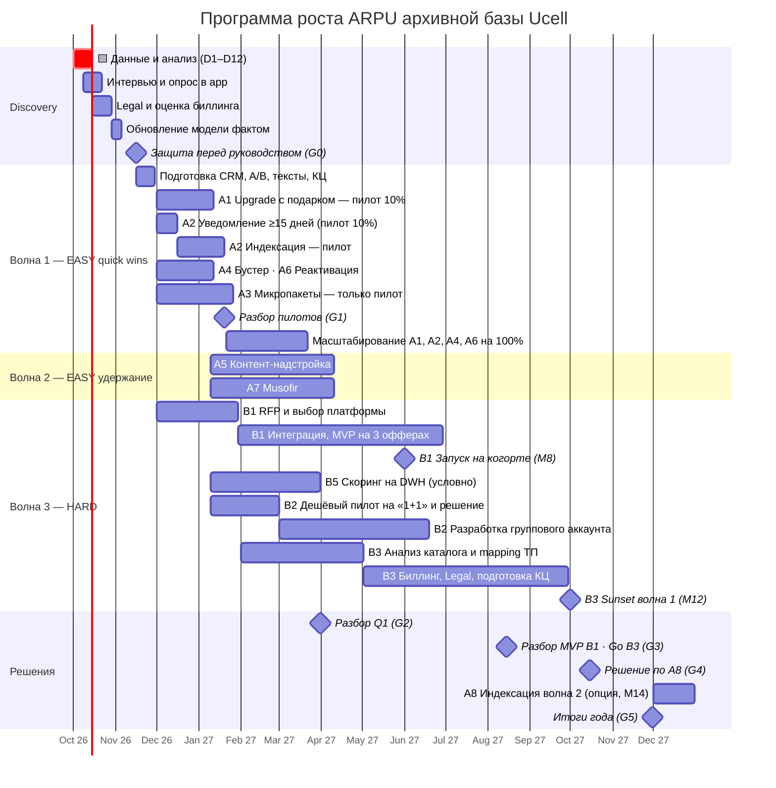

# 07. Roadmap, стейдж-гейты и OKR

> Программа стартует после защиты. M1 = ноябрь 2026. Этапы с 🟨 выполняете вы (анализ данных).

## 1. Диаграмма Ганта

## 2. Стейдж-гейты (критерии Go / No-Go)

| Гейт | Когда | Решение | Критерии «Go» |
|---|---|---|---|
| **G0** Защита | 16.11.2026 | Утвердить волны 1–2, бюджет RFP B1, анализ B3 | Данные подтвердили когорту ≥ 2,5 млн и value-gap S3; Legal без блокеров по A1/A2/A4 |
| **G1** Разбор пилотов | 20.01.2027 | Масштаб A1/A2/A4/A6; судьба A3 | A1: конверсия ≥ 5% и ΔARPU мигранта ≥ 4 000; A2: отток тест − holdout ≤ 1,5 п.п. за 45 дней, жалобы ≤ 2× нормы; A3: ΔARPU vs holdout > 0 (p < 0,05) |
| **G2** Итоги Q1 | 31.03.2027 | Go B2 (разработка), B5 | ΔARPU когорты ≥ +4%; B2 пилот «1+1» конверсия ≥ 4%; B5 стоимость ≤ 1,5 млрд |
| **G3** MVP B1 · Go B3 | 15.08.2027 | Масштаб B1; старт sunset | B1: uplift vs holdout ≥ +1,5% ARPU; B3: mapping готов, Legal ок, КЦ обучен |
| **G4** Решение A8 | 15.10.2027 | Вторая волна индексации или нет | Регуляторный фон спокойный; отток после A2 в пределах модели; инфляция ≥ 5% |
| **G5** Итоги года | 30.11.2027 | План Y2, масштаб B1 на всю базу | ΔARPU когорты ≥ +10% (цель), отток когорты ≤ база + 0,3 п.п. |

**Kill-критерии (общие):** рост оттока когорты > +0,5 п.п./мес. два месяца подряд; официальный запрос регулятора
с предписанием; падение NPS когорты > 10 пунктов — пауза всех ценовых механик (A2/B3/A8) до разбора.

## 3. OKR

**Objective (12 мес.):** Монетизировать ценность архивной базы, не теряя доверия лояльных абонентов.

| Key Result | Цель к M12 | Stretch |
|---|---|---|
| KR1 ΔARPU когорты T0 | **+10%** | +15% |
| KR2 Инкрементальная выручка Y1 (vs holdout) | ≥ 35 млрд сум | 45 млрд |
| KR3 Отток когорты | ≤ база + 0,3 п.п./мес. | ≤ база |
| KR4 Доля когорты на актуальных ТП | ≥ 20% | 30% |
| KR5 Жалобы в регулятор по тарифам | ≤ уровня 2026 | −20% |
| KR6 Число архивных тарифных кодов в каталоге | −30% (после B3) | −50% |

## 4. Команда и ритм

- **Squad «Архив»**: PM (вы), продуктовый аналитик, CVM-маркетолог, биллинг-инженер, BI/DS (B1), юрист (0,3 FTE), CX/КЦ-лид (0,3 FTE).
- **Ритм:** еженедельный стендап по пилотам; дашборд обновляется ежедневно; ежемесячный отчёт руководству; гейты — по графику выше.
- **RACI** — в [11_raci_governance.md](11_raci_governance.md).
