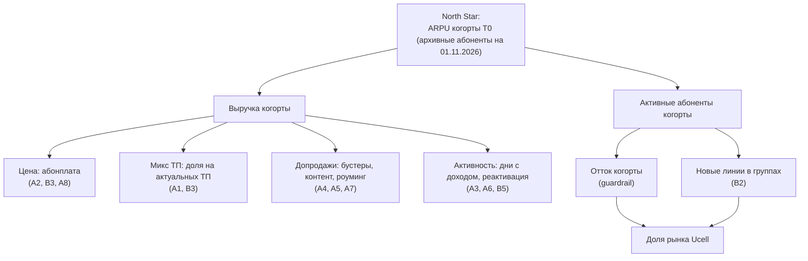

# 08. Data-Driven подход: метрики, эксперименты, решения

## 1. Дерево метрик

| Уровень | Метрика | Определение | Частота |
|---|---|---|---|
| North Star | **ARPU когорты T0** | Выручка когорты (без НДС) / активные абоненты когорты за месяц | мес. |
| Результат | Выручка когорты, инкрементальная vs holdout | Σ выручки тест − масштабированный holdout | нед./мес. |
| Драйверы | Конверсия офферов, доля даунгрейдов, ΔARPU мигранта, покупки бустеров, доля на актуальных ТП | — | ежедн. |
| **Guardrails** | Отток 30/60/90 дней; MNP port-out; обращения в КЦ на 1 000 абонентов; жалобы в регулятор; NPS/CSAT; отписки от SMS | Сравнение с holdout | ежедн./нед. |
| Здоровье | Выручка компании в целом, ARPU всей базы, доля рынка | Проверка, что нет перетока/каннибализации | мес. |

## 2. Дизайн экспериментов

**Принцип:** каждая инициатива стартует как рандомизированный эксперимент с **постоянным holdout** (5–10%
целевой группы не получает воздействия весь срок программы). Только так можно доказать руководству
*инкрементальный* эффект, а не «рост, который случился бы и так».

| # | Единица рандомизации | Группы | MDE | Мин. N на группу* | Длительность | Первичная метрика | Guardrail |
|---|---|---|---|---|---|---|---|
| A1 | Абонент | Контроль / подарок A (+50% ГБ) / подарок B (скидка 50% 1 мес.) / без подарка | 10% → 11% конверсии | ~14 750 | 6 нед. | ARPU 60 дн. | Отток |
| A2 | Абонент (страты: ТП, регион, стаж) | Holdout / +4 000 / +6 000 сум | 3% ARPU | ~25 100 | 6–8 нед. | ARPU, отток | Жалобы, MNP |
| A3 | Абонент | Holdout / оффер | 5% ARPU | ~9 000 | 8 нед. | ARPU | — |
| A4 | Событие исчерпания → абонент | Holdout / оффер / оффер + автопродление | 12% → 13% конверсии | ~17 200 | 4 нед. | Выручка бустеров | Отписки, жалобы |
| A5 | Абонент | Holdout / 1 мес. бесплатно / скидка | 2,0% → 2,5% | ~13 800 | 8 нед. | Платные подписки на 2-й мес. | Отток |
| A6 | Абонент | Holdout / оффер | 5% → 6% реактивации | ~8 200 | 4 нед. | Доля с доходом 30 дн. | — |
| A7 | Абонент | Holdout / оффер | 5% ARPU | ~9 000 | 8 нед. | ARPU, удержание | — |
| B1 | Абонент | Rule-based (A1–A7) / NBO | 1,5% ARPU | ~100 000 | 8–12 нед. | ARPU, отток | Частота контактов |
| B2 | Домохозяйство | Контроль / оффер «1+1»-пилот | 4% → 5% | ~6 700 | 6 нед. | Конверсия, линии на группу | — |

\* α = 5%, мощность 80%, CV ARPU = 1,2 (уточнить по данным D6). Калькулятор — лист AB_Calculator в Excel
и функция `ab_sample_size` в `model/arpu_model.py`. Отток 1,5% → 2,0% как guardrail требует ~10 800 на группу.

**Техники повышения чувствительности:** CUPED (ковариата — ARPU за 3 мес. до теста) снижает дисперсию на 30–50%
и сокращает выборку/срок; стратификация по сегменту и региону; фиксация гипотезы, MDE и правила остановки **до старта**
(pre-registration), чтобы не «подгонять» результат.

**Пересечение экспериментов:** один абонент — не более одной ценовой механики (A2/B3) одновременно;
контактная политика — не более 4 маркетинговых касаний в месяц (контролирует B1 после запуска, до него — CVM-календарь).

## 3. Правила принятия решений

| Результат пилота | Решение |
|---|---|
| Эффект значим и ≥ MDE, guardrails в норме | Масштабировать на 100% (кроме holdout) |
| Эффект значим, но < MDE | Масштабировать, если вклад > 0 по модели с фактическими параметрами |
| Эффект незначим | Итерация (другой оффер/канал) — максимум 2 раза, потом закрыть |
| Guardrail нарушен (отток/жалобы) | Стоп, откат, разбор причин |

## 4. Дашборд программы (что должно быть в BI)

1. **Когорта:** ARPU, выручка, активные абоненты, отток — тест vs holdout, по месяцам, по сегментам S1–S5.
2. **Воронки инициатив:** охват → доставка → отклик → конверсия → ΔARPU через 30/60/90 дней.
3. **Guardrails:** отток, MNP, звонки в КЦ по теме «тариф», жалобы, отписки — с порогами и алертами.
4. **Модель vs факт:** P50-прогноз из `results.json` vs фактическая инкрементальная выручка (контроль точности модели).
5. **Регуляторный журнал:** даты уведомлений, охват, соцгруппа исключена (контроль соблюдения).

## 5. Атрибуция эффекта

- Инкрементальность = разница тест vs holdout (не «до/после»).
- При одновременных механиках — факторный дизайн или последовательные пилоты на непересекающихся группах.
- Эффект портфеля = когорта (все механики) vs глобальный holdout 5% когорты, не получающий **ничего** — главный
  аргумент для итогового отчёта руководству.
