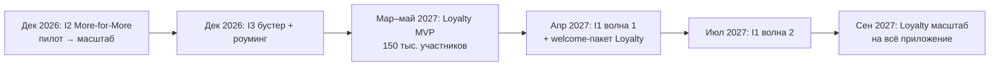

# 03. Инициативы 1–3: карточки

> Все три касаются **только абонентов архивных тарифов**. Цифры — Монте-Карло, **P50 (P10…P90)**, млрд сум без НДС.
> M1 = ноябрь 2026. Международные кейсы по этим механикам — [02](02_benchmarks.md).
> I1 и I2 работают на **непересекающихся** наборах линеек. Пересечение I3 с I2 учтено поправкой 10%.

## Сводка

| # | Инициатива | Старт | Выручка Y1 | Выручка Y2 | Вклад 24 мес. | ΔARPU когорты* | Шанс успеха |
|---|---|---|---|---|---|---|---|
| **I1** | Sunset / Migration → ТП дороже на 10–15% | апрель 2027 (2 волны) | 15,8 (12,4…20,0) | 29,7 (23,2…37,8) | **35,6** (25,6…47,6) | **+6,2%** | **65%** |
| **I2** | More-for-More (+ АП, + трафик) | декабрь 2026 (пилот 10%) | 20,7 (16,6…25,1) | 22,8 (18,2…27,7) | **36,8** (28,2…45,9) | **+4,5%** | **80%** |
| **I3** | Бустер при исчерпании + роуминг-промо | декабрь 2026 | 4,3 | 4,5 | 5,0 | +0,7% | 90% |

\* через 12 мес. после старта инициативы.

---

## I1. Sunset / Migration старых неэффективных линеек

**Что делаем.** Закрываем семейства архивных тарифов, которые неэффективны:
- низкая абонплата при высоком потреблении;
- мало абонентов на линейке;
- дорогое сопровождение в биллинге.

Абонентов переводим на **ближайший актуальный тариф, который дороже их текущей абонплаты на 10–15%**
и даёт больше трафика и минут.

**Целевая группа:** ~30% архивной когорты (~1,06 млн). 🟨 Список линеек — из анализа D3 (value-gap).
Соцгруппа (ж 55+, м 60+) переводится на тариф **с той же ценой**.

**Механика (по каждой волне):**

| Когда | Что происходит |
|---|---|
| T−60 дней | Персональное предложение «выберите сами»: mapped-ТП или крупнее, с подарком (500 монет Loyalty + 3 сундука) |
| T−15 дней | Официальное уведомление: SMS, сайт, приложение. Указаны сумма «было → стало», что добавлено и как бесплатно выбрать другой тариф |
| T0 | Автоперевод оставшихся. Остатки пакетов сохраняются |
| T+30 дней | Персональное предложение right-size для тех, кому новый тариф велик |

Волны: **апрель 2027 (50%)** и **июль 2027 (50%)** — чтобы не перегрузить контакт-центр и успеть поправить механику после первой.

**Модель:**
- повышение +10…15% к абонплате ~20 тыс.: **+2 232 сум net**;
- 8–20% выбирают тариф крупнее: +6…15 тыс.;
- даунгрейд 4–14%;
- доп. отток 1,5–5%;
- разовые затраты на биллинг и миграцию — 3–8 млрд;
- экономия на сопровождении каталога — 30–120 млн/мес.

**Unit-экономика:**
- **+2 280 сум/мес.** на затронутого абонента;
- разовые затраты 4 935 сум на абонента, окупаемость **~2,2 мес.**;
- инициатива остаётся прибыльной, пока доп. отток < **15,7%** группы.

**Сложность:** высокая (массовая миграция, чистка тарифных кодов). **P(запуска) 65%.**

**KPI:** доля выбравших сами; ΔARPU мигрантов vs контроль; отток 30/60/90 дней; обращения в КЦ;
число закрытых тарифных кодов.

---

## I2. More-for-More для когорты недооценённых линеек

**Что делаем.** Для архивных линеек, где абонент платит мало, а пакет использует полностью, поднимаем абонплату
на **+4 000…6 000 сум** и одновременно **увеличиваем трафик**.

Рядом всегда бесплатная альтернатива right-size. Это ответ на публичную критику «платим за ГБ, которые не используем»
(кейс Beeline Oila Max).

**Целевая группа:** ~22% когорты (~775 тыс.), без соцгруппы и без тарифов, изменённых 03.02.2026.

**Волны:** пилот 10% с контрольной группой — **декабрь 2026**; масштаб 90% — **февраль 2027**.

**Unit-экономика:**
- **+2 873 сум/мес.** на затронутого абонента, окупаемость ~5 дней;
- инициатива безубыточна до доп. оттока **14%** (в модели заложено 2,5%).

**Сложность:** низкая (параметр тарифа + CRM). **P(запуска) 80%.** Главный риск — регуляторный:
Комитет по конкуренции запрашивал обоснования повышений в ноябре 2025.

**KPI:** ΔARPU vs holdout; доля даунгрейдов; отток; жалобы.
**Стоп-критерий:** отток тест − контроль > 1,5 п.п. за 45 дней или жалобы > 2× нормы.

---

## I3. Пакет для тех, кто исчерпывает трафик + роуминг-пакет по акции

### I3a. Бустер в момент исчерпания

- **Кому:** архивные абоненты, которые исчерпывают пакет до конца месяца (~15% когорты, 🟨 D3/D5).
- **Механика:**
  - триггер «осталось 20% / 0%» → USSD / push «+5 ГБ за X сум»;
  - опция **автопродления только по явному согласию**, лимит 3 бустера в месяц.
- **Экономика:** ~31 тыс. инкрементальных покупателей, LTV/CAC **10,1**, окупаемость 2,1 мес., вклад 24 мес. ~3,3 млрд.

### I3b. Роуминг-пакет по акции

- **Кому:** архивные абоненты с роумингом или международными звонками за 12 мес. (~6%). Это прежде всего
  трудовые мигранты: переводы $18,9 млрд в 2025, ~1,3 млн работают в РФ.
- **Механика:**
  - пакет «Musofir»: SMS банков + мессенджеры + ГБ в СНГ, Корее, Турции;
  - **−50% на первый месяц**;
  - триггер — первая регистрация в сети роуминг-партнёра, плюс предложение до выезда;
  - сезонные пики: после праздников и весной.
- **Экономика:** ~25 тыс. покупателей, LTV/CAC **6,8**, окупаемость 3,4 мес.; отток адоптеров ниже на 10–35%.

**Сложность I3:** низкая. **P(запуска) 90%.**

---

## Как инициативы и Loyalty работают вместе

Loyalty смягчает ценовые изменения I1 и I2. Каждому, у кого меняется тариф, — welcome-пакет программы.
Лестница шансов и рост кэшбэка дают стимул **самому** выбрать старший тариф.
