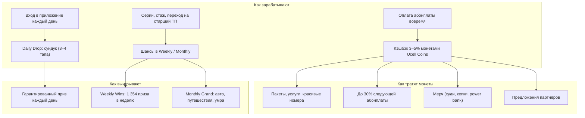

# 04. Loyalty-программа: механика, призы, бюджет по компонентам

> Рабочее название: **«Ucell Club»** (финальное — за маркетингом). Ориентир — Verizon: **Verizon Dollars**
> (3% от ежемесячного счёта) + **Verizon Shine** (ежедневные Daily Drops и еженедельные розыгрыши в приложении).
> Цифры — из `v2/model` (план на модальных значениях; диапазоны — в [08](08_success_probability.md)).
> Цены призов — ориентиры на октябрь 2026, перед закупкой уточнить.

## 1. Архитектура программы

## 2. Слой 1 — кэшбэк Ucell Coins

| Правило | Значение | Почему так |
|---|---|---|
| Начисление | **3%** при АП < 60 тыс., **4%** при 60–79 тыс., **5%** при ≥ 80 тыс. сум; 1 монета = 1 сум | Сохраняет вашу вилку 3–5% и даёт стимул перейти на старший тариф. Средняя ставка по участникам — 3,74% |
| Условие | Только за **оплату вовремя** (до даты списания + 3 дня grace) | Кэшбэк платит за нужное поведение, а не за всё подряд |
| Срок жизни | 12 месяцев | Breakage 25–40%; у Safaricom после введения срока сгорания неиспользованные баллы сократились на 34% за год |
| Траты | Пакеты и услуги Ucell, красивые номера, **до 30% следующей абонплаты**, мерч, партнёры | Лимит 30% не даёт кэшбэку стать скрытой скидкой |
| Мерч | Худи 160 тыс., кепка 60 тыс., power bank 180 тыс. сум (себестоимость); цена в монетах с наценкой ~40% | Ощутимая «вещь от Ucell»; наценка покрывает логистику |
| Учёт | По МСФО (IFRS 15) часть выручки, приходящаяся на монеты, **откладывается** до погашения | Должен заранее знать CFO: ARPU в отчётах слегка сдвигается во времени |

**Экономика:** участник в среднем получает 1 842 монеты в месяц. Ucell это обходится примерно в **560 сум**: оплату
получают 85% участников, сгорает 30% монет, себестоимость погашения 0,515. Погашение пакетами
стоит нам 15% номинала, погашение счёта — 100%, мерч — около 70%. Поэтому в интерфейсе первыми должны стоять
пакеты и номера, а оплата счёта — последней.

**Для архивного абонента** с АП 20 тыс. это около 600 монет в месяц. Самого кэшбэка мало, поэтому для
архивной базы главную ценность дают Daily Drops и лестница шансов (раздел 5).

## 3. Слой 2 — Daily Drops: сундук каждый день

**Механика.** Один раз в сутки участник открывает сундук: 3–4 тапа, анимация, приз. **Пустых сундуков не бывает:**
это главный инструмент против разочарования. Серия из 7 дней подряд даёт +1 шанс в Weekly Wins.

### Что выпадает (цифровые призы, на одно открытие)

| Приз | Вероятность | Себестоимость | Ожидаемая стоимость открытия |
|---|---|---|---|
| 30–100 Ucell Coins | 50% | 23 сум | 11,5 сум |
| 300 МБ – 1 ГБ интернета | 25% | 150 сум | 37,5 сум |
| 30 мин внутри сети / безлимит мессенджеров на сутки | 7% | 40 сум | 2,8 сум |
| Купон партнёра (−10…30%) | 14% | 5 сум (финансирует партнёр) | 0,7 сум |
| Жетон серии: +1 шанс в Weekly Wins | 2% | 0 | 0 |
| Слот инвентаря (кино, мерч, наушники, смартфон) | 2% | отдельный недельный лимит | — |
| **Итого** | **100%** | | **52,5 сум** |

### Недельный инвентарь, который «падает» из сундуков (масштаб)

| Приз | В неделю | Цена, сум | Софинансирование | Затраты в неделю |
|---|---|---|---|---|
| 2 билета в кино | 500 пар (1 000 билетов) | 160 тыс. | 50% кинотеатр | 40,0 млн |
| Худи с принтом | 100 | 160 тыс. | — | 16,0 млн |
| Кепка / шоппер | 60 | 60 тыс. | — | 3,6 млн |
| Power bank | 40 | 180 тыс. | — | 7,2 млн |
| Наушники JBL | 20 | 700 тыс. | — | 14,0 млн |
| Samsung Galaxy A | 2 | 4,5 млн | — | 9,0 млн |
| **Итого** | **1 222 единицы** | | | **89,8 млн сум/нед.** |

### Тематический календарь недели (чтобы приходили каждый день)

| Пн | Вт | Ср | Чт | Пт | Сб | Вс |
|---|---|---|---|---|---|---|
| Монеты ×2 | День интернета | Партнёрский день (еда, такси, кофе) | Кино | **Мерч-дроп** (ограниченная серия) | Развлечения (подписки) | Бонус серии + анонс Weekly Wins |

### Правило «никто не уходит в минус» (ни Ucell, ни партнёр)

1. **Цифровая часть.** Ожидаемая себестоимость открытия ≤ 50–55 сум. Это контролируется таблицей вероятностей
   и пересчитывается каждую неделю.
2. **Инвентарь.** Это фиксированный недельный лимит (89,8 млн). Вероятность выпадения рассчитывается
   динамически: остаток инвентаря / ожидаемое число открытий. Перерасход невозможен.
3. **Партнёр.** Партнёр не платит деньгами за купоны, он даёт скидку из своей маржи и только при покупке.
   Пример: кинотеатр с 2 билетами за 1 заполняет пустые места почти без своих затрат. Наша часть
   (50% стоимости билета) — бюджет инвентаря.
4. **Итог.** Стоимость открытия с инвентарём — около 81 сум. Допродажи в приложении окупают примерно 33 сум
   на открытие, остаток окупается удержанием и оплатами вовремя. Именно эти гипотезы проверяет MVP
   ([11](11_data_driven_mvp.md)).

## 4. Слой 3 — Weekly Wins: розыгрыш каждую неделю

| Уровень | Приз | В неделю | Цена | Затраты в неделю |
|---|---|---|---|---|
| Главный | iPhone 17 256 ГБ | 1 | 12,5 млн | 12,5 млн |
| Крупные | Планшет Samsung Galaxy Tab A9+ | 2 | 3,0 млн | 6,0 млн |
| | AirPods 4 | 5 | 2,0 млн | 10,0 млн |
| Впечатления | 2 билета на концерт (50% партнёр) | 10 | 1,2 млн | 6,0 млн |
| | 2 билета в кино (50% партнёр) | 30 | 160 тыс. | 2,4 млн |
| Premium-пул (только АП ≥ 80 тыс.) | Samsung Galaxy A | 1 | 4,5 млн | 4,5 млн |
| | Наушники JBL | 5 | 700 тыс. | 3,5 млн |
| **Массовый уровень** | 5 ГБ интернета | 1 000 | ~1 250 сум себестоимость | 1,25 млн |
| | Ваучер партнёра (номинал 100 тыс.) | 300 | 100% партнёр | 0 |
| **Итого** | | **1 354 приза** | | **46,1 млн сум/нед. (~200 млн/мес.)** |

Массовый уровень важен. Без него шанс выиграть за неделю — 1 к 27 500, и программа воспринимается как «никто не
выигрывает». С ним шанс 1 к ~1 100, то есть в среднем каждый 20-й активный участник что-то выигрывает за год,
не считая ежедневного сундука.

**Идеи призов-впечатлений** в стиле Verizon («once in a lifetime»):
- выезд на матч сборной Узбекистана;
- закрытый показ премьеры для победителей;
- встреча со звездой узбекской эстрады, backstage концерта;
- мастер-класс в Tashkent City.

Часть таких призов может дать партнёр в обмен на видимость.

## 5. Шансы: лестница вместо стены (рекомендация по порогу)

| Полоса АП | Кэшбэк | Шансов в неделю | Доступ |
|---|---|---|---|
| < 30 тыс. (≈80% архивной базы) | 3% | 1 | Weekly + Monthly, если оплата вовремя |
| 30–59 тыс. | 3% | 2 | Weekly + Monthly |
| 60–79 тыс. | 4% | 3 | + приоритетные дропы |
| ≥ 80 тыс. | 5% | 5 | + Premium-пул Weekly |
| Бонусы для всех | | +1 за серию 7 дней; +1 за каждые 5 лет стажа; +10 разово за переход на тариф ≥ 60 тыс. | |
| **Club+ Pass** (9 999 сум/мес., опция для АП < 60 тыс.) | ×1,5 кэшбэк | как у полосы 60–79 тыс. | +5 ГБ, 2 сундука в день |

Почему это лучше порога «только ≥ 60/80 тыс.» и платного входа за 4 999 / 9 999 — в [05](05_threshold_win_win.md).

## 6. Слой 4 — Monthly Grand: в приложении или в соцсетях?

| Критерий | Только соцсети (лайк / репост) | Только приложение | **Гибрид (рекомендуем)** |
|---|---|---|---|
| Кто участвует | Любой, включая не-абонентов и ботов | Только абоненты-участники | Только абоненты-участники |
| Связь с ARPU / оплатой вовремя | Нет | Да (шансы за поведение) | Да |
| Охват / виральность | Высокий | Низкий | **Высокий:** розыгрыш в прямом эфире Instagram / Telegram / YouTube |
| Доверие | Низкое (часто фейки, UzAuto предупреждал о мошеннических «розыгрышах Chevrolet») | Среднее | **Высокое:** эфир + нотариус / комиссия + проверяемый генератор |
| Контроль мошенничества | Плохой | Хороший | Хороший |

**Решение: шансы копятся в приложении, сам розыгрыш — прямой эфир в соцсетях** (так делает Mobiuz с MobiDRIVE).
Условие участия: ≥ 4 недель оплаты вовремя подряд.

### Календарь на 12 месяцев (масштаб)

| Месяц | Приз | Стоимость |
|---|---|---|
| Сен, Дек, Мар, Июн | Chevrolet Onix 1LS MT | 176,9 млн × 4 |
| Окт, Янв, Апр, Июл | Путешествие в Турцию на двоих (7 ночей) | ~32 млн × 4 |
| Ноя, Авг (сезон умры, под Рамадан — сдвинуть) | Умра на двоих | ~50 млн × 2 |
| Фев | 5 × iPhone 17 | 62,5 млн |
| Май | 10 × «год связи бесплатно» | 12 млн |
| **Итого** | | **1,01 млрд/год + 10% накладные ≈ 92,6 млн/мес.** |

Альтернативы:
- Cobalt (146,5 млн) вместо Onix экономит ~120 млн в год;
- тур Самарканд–Бухара–Хива на Afrosiyob на двоих (~7 млн) — дешёвый и патриотичный приз для месяцев без авто.

## 7. Бюджет программы по компонентам (план, млрд сум)

| Компонент | Y1 (ноя 26 – окт 27) | Y2 | Y3 | В месяц при масштабе |
|---|---|---|---|---|
| Кэшбэк (себестоимость погашений) | 0,93 | 9,22 | 10,06 | 0,84 |
| Daily Drops — цифровые | 0,78 | 7,72 | 8,42 | 0,70 |
| Daily Drops — инвентарь | 0,95 | 4,28 | 4,67 | 0,39 |
| Weekly Wins | 0,49 | 2,20 | 2,40 | 0,20 |
| Monthly Grand | 0,23 | 1,02 | 1,11 | 0,09 |
| Разработка (MVP 1,8 + масштаб 3,0) | 4,80 | — | — | — |
| Операционные (команда, фулфилмент, КЦ) | 1,22 | 3,00 | 3,00 | 0,25 |
| Маркетинг | 2,05 | 1,80 | 1,80 | 0,15 |
| **Итого затраты** | **≈ 12,2** | **≈ 29,0** | **≈ 31,2** | **≈ 2,6 (~$215 тыс.)** |

На одного участника — около **1 765 сум в месяц** (~$0,15), это 4% от ARPU участника (43,9 тыс. сум).

**Бюджет MVP** (150 тыс. участников, 3 месяца, март–май 2027):
- всего **≈ 3,5 млрд сум (~$290 тыс.)**;
- из них разработка 1,8 млрд, сам тест 1,7 млрд;
- на одного участника MVP — 23 тыс. сум.

Детали — лист `MVP_Budget` в Excel.

## 8. Окупаемость (план)

- Помесячный вклад программы становится **положительным с M20 (июнь 2028)**.
- Накопленный вклад выходит в плюс на **M31–M32 (май–июнь 2029)**.
- За 36 мес. вклад **+12,4 млрд сум (P50)**; P(> 0) = 84%.
- Главные рычаги окупаемости (tornado): доп. переходы на старшие тарифы, снижение оттока, рост доли оплат вовремя.
  Поэтому именно они — **гипотезы H1–H3 MVP**.

## 9. Антифрод и правила

- Один участник = один номер, один паспорт (данные регистрации SIM); участвуют только лица 18+.
- Лимит монет из сундуков — не больше 1 500 в месяц; при аномалиях частоты открытий — капча.
- Победители Weekly / Monthly должны быть активны в сети 90 дней и не иметь долга.
- Розыгрыш через проверяемый генератор (seed публикуется заранее), в присутствии нотариуса или комиссии.
- Победители публикуются с маскированием номера и разбивкой по регионам.
- Правила акции (оферта) публикуются в приложении и на сайте; изменения — с уведомлением ≥ 15 дней.

## 10. Как это влияет на абонентов архивных тарифов

| Эффект | Величина (план) |
|---|---|
| Архивных участников к M24 | ~285 тыс. (8% архивной когорты); ограничитель — доля пользователей приложения |
| Доступ к Weekly / Monthly | **100%** архивных участников при оплате вовремя (против 3% при пороге ≥ 60 тыс.) |
| Вклад в ARPU архивной когорты | **+0,9% к M24, +1,5% к M36** |
| Главный механизм | Лестница шансов и бонус за переход: стимул уйти с архива на актуальный ТП (синергия с I1, I2) |
| Защита от негатива при I1 / I2 | При повышении абонплаты — welcome-пакет программы: 500 монет + 3 сундука. «Мы подняли цену, но вот что вы получаете» |
