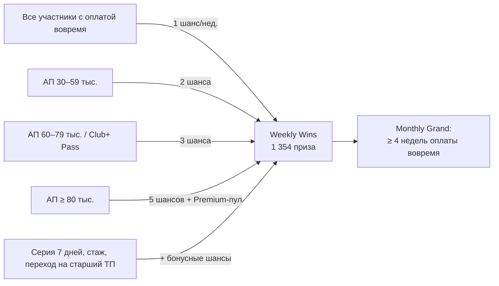

# 05. Порог участия: анализ вариантов и решение win-win

> Ваш вопрос: ограничить ли Weekly / Monthly абонентами, которые платят вовремя и имеют АП ≥ 60 000 / 80 000 сум,
> а остальным дать участие за 4 999 / 9 999 сум? Ниже 5 вариантов, расчёт и рекомендация.
> Расчёт — лист `Thresholds` в Excel и `threshold_analysis()` в модели. Это стационарный режим масштаба
> (~1,49 млн участников). Кэшбэк, Daily Drops и OPEX одинаковы во всех вариантах и в сравнение не входят.

## 1. Ключевой факт про архивную базу

По гипотезе (🟨 проверить данными L2) **у ~97% архивных участников АП < 60 тыс. сум**, у ~80% — меньше 30 тыс.
Жёсткий порог ≥ 60 тыс. отсекает от розыгрышей почти всю архивную базу — ту самую, чей ARPU мы растим.
Среди всех участников программы ниже 60 тыс. — около 70%.

## 2. Сравнение вариантов (млн сум в месяц, план)

| Вариант | Играют в Weekly / Monthly | Из них архивных | Эффект удержания | Эффект переходов на ≥ 60 тыс. | Pass / платный вход | Призы W+M | **Чистый эффект** | С учётом риска запрета | Юр. риск | PR-риск |
|---|---|---|---|---|---|---|---|---|---|---|
| **O1** Открыто всем | 100% | 100% | 1 122 | 397 | 0 | −293 | **1 226** | 1 202 | низкий | низкий |
| **O2** Только АП ≥ 60 тыс. + оплата вовремя | 30% | 3% | 886 | 715 | 0 | −293 | **1 309** | 1 269 | низкий | средний |
| **O3** Только АП ≥ 80 тыс. | 30% | 3% | 808 | 477 | 0 | −293 | **992** | 942 | низкий | **высокий** |
| **O4** Порог 60 тыс. + платный вход 4 999 / 9 999 | 33% | 7% | 965 | 556 | 278 | −293 | 1 507 | **904** | **ВЫСОКИЙ** | высокий |
| **O5 ✅** Играют все, шансы растут с АП + Club+ Pass | 100% | 100% | 1 122 | 993 | 209 | −293 | **2 031** | **1 929** | низкий–средний | низкий |

Поведенческие допущения по вариантам:
- **Вовлечённость участников < 60 тыс.:** O1 и O5 — 100%, O2 — 70%, O3 — 60%, O4 — 80%. Те, кого исключили,
  меньше пользуются программой, поэтому эффект удержания у них ниже.
- **Доп. переходы на ≥ 60 тыс. в месяц:** O1 0,20%, O2 0,36%, O3 0,24%, O4 0,28%, O5 0,40%.
  - В O3 стимула почти нет: разрыв между тарифами слишком велик.
  - В O4 платный вход заменяет переход на старший тариф.
  - В O5 действуют одновременно лестница шансов, бонус +10 шансов за переход и рост кэшбэка.
- **Вероятность запрета или предписания:** O4 — 40% (платный шанс = лотерея), у остальных 2–5%.

**Это гипотезы.** MVP проверяет главную развилку O2 против O5 двумя ветками эксперимента ([11](11_data_driven_mvp.md)).

## 3. Почему не платный вход за 4 999 / 9 999 сум (O4)

1. **Юридически это лотерея.** Участник платит за шанс выиграть приз, исход случаен. С 2025 года
   в Узбекистане лотереи разрешены **только по лицензии**: её выдаёт Национальное агентство перспективных проектов,
   стоимость 18,75 млн сум, только для резидентов, участники 18+. Лицензионные требования к организаторам
   (капитал, ИТ, отчётность) делают это отдельным бизнесом, а не акцией оператора.
2. **Репутационно** государственный оператор, продающий «билетики» абонентам с минимальным тарифом, —
   готовый негативный заголовок. Плюс Комитет по конкуренции уже следит за ценовыми действиями операторов.
3. **Экономически** платный вход **заменяет** переход на старший тариф: зачем платить +20 тыс. в месяц,
   если можно 7,5 тыс. только за шанс. Поэтому эффект переходов в O4 ниже, чем в O2.
4. С учётом риска запрета O4 даёт меньше всех: **904 млн в месяц**.

### Кейс конкурента: Beeline «hambi fortuna» / «Fortuna Plus»

| Что видно в открытых источниках | Деталь |
|---|---|
| Механика | Колесо в приложении hambi: **3 бесплатные попытки** («Fortuna») и **платная «Fortuna Plus»** — 1 490 сум за попытку (по данным акции мая 2026; цена могла меняться). Призы — iPhone, Samsung, MacBook, пакеты по 150 ГБ, лимиты P2P-переводов; розыгрыши по средам, субботам и воскресеньям |
| Организатор | В правилах «BeeFortuna Plus» организатор — **ViaMobi** (контент-партнёр), Beeline даёт канал и биллинг. Акция описана как «поощрение пользователей» |
| Прецедент | В 2020 году Агентство по развитию рынка капитала (тогдашний регулятор лотерей) проверяло промо Beeline + ViaMobi: **у организаторов не было лицензии на лотереи**, а без неё такая деятельность запрещена |
| Наша оценка | По сути (плата → случайный исход → приз) это признаки лотереи. Конкурент, по всей видимости, опирается на бесплатный путь участия, вынесение организатора на партнёра и формулировку «акция». **Это серая зона, а не доказанная законность.** С 2025 года лицензии на лотереи выдаёт НАПП, контроль только усиливается |
| Для Ucell | Ucell — государственный оператор, репутационная планка выше. Копировать не рекомендуем. Если платная механика всё же нужна — только (1) через **партнёра с лицензией НАПП** (он — организатор лотереи, Ucell — канал и доля выручки) или (2) по схеме Club+ Pass (платим за ценность, шансы — бонус, бесплатный путь есть). В обоих случаях — заключение Legal до запуска |

## 4. Рекомендация — O5 «Играют все, шансы растут вместе с тарифом»

| Сторона | Что получает (win) |
|---|---|
| **Абонент архивного ТП** | Играет **наравне по праву, но с меньшим числом шансов**. Ежедневный гарантированный приз; бонусы за стаж (архивные абоненты — самые «старые» клиенты); понятный путь к большему числу шансов |
| **Абонент с высокой АП** | В 5 раз больше шансов, Premium-пул, 5% кэшбэка — его «ценят больше», но остальных не исключают |
| **Ucell** | Максимальный эффект на удержание (никто не исключён). Сильнее всего стимул перейти на старший ТП. Доход от Club+ Pass. Минимальный юр. и PR-риск |
| **Партнёры** | Аудитория всех ~1,5 млн участников плюс отдельный премиальный сегмент для дорогих предложений |

### Club+ Pass — законная версия идеи «заплати 9 999 и участвуй»

| Параметр | Значение |
|---|---|
| Цена | 9 999 сум/мес. (подписка, отмена в 1 клик) |
| Реальная ценность | +5 ГБ, кэшбэк ×1,5, второй сундук в день, скидка на красивый номер (рыночная ценность ГБ — выше цены) |
| Шансы | Как у полосы 60–79 тыс. (3 в неделю) — **бонус к продукту, а не предмет продажи** |
| Бесплатный путь | Всегда есть: оплата вовремя даёт шансы без Pass (принцип *no purchase necessary*, как у Verizon и в американских sweepstakes) |
| Ожидаемый спрос | 2–5% участников с АП < 60 тыс. (мода 3%) → ~210 млн сум/мес. чистыми |
| Юр. статус | До запуска — заключение юристов: Pass не должен считаться платой за участие в лотерее (ценность ≥ цены, бесплатный путь сохраняется) |

**Оплата вовремя** — единственное жёсткое условие для Weekly / Monthly. Оно законно и честно (поощряем
дисциплину, а не размер кошелька) и прямо поднимает выручку: меньше дней блокировки.

## 5. Как нейтрализовать негатив тех, кто не может участвовать или выигрывает реже

| Кто | Что делаем |
|---|---|
| Опоздал с оплатой | Grace 3 дня. Участие возвращается со следующего месяца, без «вечного бана». Напоминание за 2 дня до даты |
| Низкая АП (архив) | Ежедневный сундук **без пустых призов**; бонусные шансы за стаж; персональный путь «перейдите на X — получите +10 шансов и 5% кэшбэка» |
| Пенсионеры (ж 55+, м 60+) | Участвуют на общих основаниях; отдельный уровень «Ehtirom» с бонусом стажа ×2; простой интерфейс |
| Без смартфона / без приложения | USSD-версия: *XXX# — «открыть сундук», баланс монет; шансы за оплату вовремя начисляются автоматически |
| Никогда не выигрывал | Ежемесячный «второй шанс» среди невыигравших (1 ГБ / кино); счётчик «вы ближе к призу»: шансы не сгорают внутри месяца |
| Все | Прозрачность: публикуем число призов, шансы и победителей по регионам; правила на узбекском и русском |

## 6. Влияние на абонентов архивных тарифов (итог)

| Вариант | Архивных в розыгрышах | Влияние на миграцию с архива | Риск негатива |
|---|---|---|---|
| O2 / O3 (жёсткий порог) | 3% | Слабое: до 60 тыс. в 3 раза дороже текущего тарифа | Высокий: «программа не для нас» |
| O4 (платный вход) | ~7% | Отрицательное: платят за шанс вместо перехода | Высокий |
| **O5** | **100%** | **Сильное:** каждый шаг вверх (30 → 60 → 80 тыс.) даёт больше шансов и кэшбэка | Низкий |
