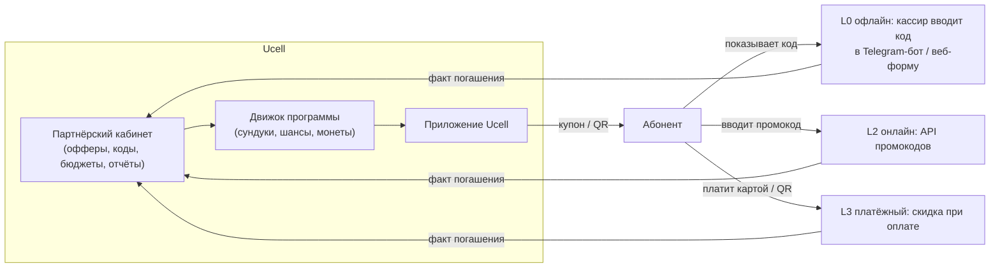

# 06. Партнёры: как вовлечь, как работает система, офлайн-партнёры, брать ли деньги

## 1. Ценностный обмен

| Партнёр получает | Ucell получает |
|---|---|
| Охват ~1,5 млн активных пользователей приложения (MVP — 150 тыс.) | Призы и скидки без денег: билеты, еда, такси, подписки |
| Таргетинг по региону, возрасту, интересам, уровню АП (без передачи персональных данных) | Ежедневный повод открыть приложение |
| Новых клиентов: платит только за результат (погашенный купон) | Данные о предпочтениях → лучшие офферы (NBO) |
| Бренд-интеграцию: «Кино-четверг с [партнёр]», брендированный сундук | Позже — денежный доход от платных размещений |

**Как это работает в мире:**
- **T-Mobile Tuesdays:** партнёры (кофе, пицца, кино) дают бесплатные подарки ради видимости. Более 90 млн погашений,
  отток участников программы −27%.
- **Verizon Dollars:** партнёры дают до 20× ценности монет.
- **Tele2 «Больше»:** скидки партнёров, Tele2 партнёрам не платит.
- **МТС Cashback:** кэшбэк до 25% финансируют партнёры.

## 2. Отвечаю на вопрос «брать ли деньги с партнёров за видимость?»

**Коротко: на старте — нет деньгами, да «натурой». Деньгами — после того, как докажем трафик.**

| Этап | Модель | Почему |
|---|---|---|
| **MVP и первые 6 мес. масштаба** | **Бартер:** партнёр финансирует призы и скидки (50–100%), мы даём видимость бесплатно | На старте нам партнёры нужнее, чем мы им: нет статистики. Призы от партнёра — это уже оплата, только не деньгами |
| **Через 6 мес. масштаба** (есть данные: MAU, CTR, погашения) | **Performance (CPA):** партнёр платит за погашённый купон или нового клиента (например, 5–15% чека или фикс) | Партнёр платит только за результат, ему легко согласиться |
| **Зрелая программа** | **Платные размещения:** Featured Drop, брендированный сундук, баннер на главной, эксклюзив категории | Видимость на платформе с 1,5 млн MAU имеет рыночную цену, сопоставимую с рекламой в Telegram / Instagram |

В модели платные размещения заложены консервативно: 0–150 млн сум/мес. (мода 50 млн) с 6-го месяца масштаба.
Основной вклад партнёров — софинансирование призов: 50% кино и концертов, 100% ваучеров и купонов.

**Правило «никто не в минусе»:** партнёр даёт скидку из маржи и только при покупке. Для кинотеатра пустое
кресло стоит ~0, для доставки еды скидка ниже их стоимости привлечения клиента (CAC). Мы не обещаем партнёру
продаж, но даём измеримый трафик и отчёт.

## 3. Кого привлекать (категории для Узбекистана)

| Категория | Примеры типов партнёров | Что дают |
|---|---|---|
| Кино и события | Кинотеатры Ташкента и регионов, концертные агентства, футбольные клубы | 2 по цене 1, билеты в Weekly Wins, закрытые показы |
| Еда и кофе | Сети кофеен, фастфуд, доставка еды | Купоны −15…30% в Daily Drops |
| Такси и мобильность | Агрегаторы такси, кикшеринг | Промокоды на поездку |
| Ритейл и e-commerce | Супермаркеты, маркетплейсы, магазины электроники | Ваучеры, скидки, призы со скидкой поставщика |
| Финтех | Банки и платёжные приложения | Кэшбэк при оплате, бонус за привязку карты (с согласия) |
| Подписки | Онлайн-кино, музыка | Пробные месяцы (как Yandex Plus в BOR 90) |
| Образование и здоровье | Языковые курсы, IT-школы, фитнес, аптеки | Скидки — важны для семейной аудитории |

*Названия конкретных компаний — только после переговоров; на этапе Discovery составить шорт-лист из 20–30 партнёров.*

## 4. Как работает система: уровни интеграции

| Уровень | Для кого | Как погашается | Сверка | Срок подключения |
|---|---|---|---|---|
| **L0 — без ИТ** | Офлайн-точки без системы учёта (кафе, магазин, салон) | Абонент показывает **уникальный одноразовый код / QR** в приложении. Кассир вводит код в **Telegram-бот Ucell Partner** или простую веб-страницу. Бот отвечает «действителен» и помечает код использованным | Автоматически по базе кодов; раз в месяц — акт (если есть софинансирование) | 1–3 дня |
| **L1 — пакет кодов** | Партнёр с кассой, но без API | Ucell генерирует CSV с уникальными кодами, партнёр загружает их в кассу или промо-модуль | Ежемесячная выгрузка погашений от партнёра | 1–2 недели |
| **L2 — API** | E-commerce, доставка, такси, онлайн-сервисы | Промокод через API или ссылку; вебхук о покупке | В реальном времени | 2–6 недель |
| **L3 — платёжный** | Партнёры, принимающие оплату через платёжные системы и QR | Скидка или кэшбэк при оплате | Автоматически | 1–3 месяца |

**Для тех, у кого «не всё оцифровано»** — уровень L0. От партнёра нужен только смартфон с Telegram у кассира.
Защита от злоупотреблений:
- коды одноразовые и привязаны к номеру абонента, живут 24–72 часа;
- лимит погашений на точку в день;
- выборочные проверки «тайным покупателем»;
- если партнёр подтверждает погашения без визитов — он теряет доступ.

Ручной вариант без бота (статичный код + месячный отчёт партнёра) допустим только для **бесплатных для Ucell**
скидок, где нам не за что платить по акту.

## 5. Процесс подключения партнёра (5 шагов)

1. **Отбор:** соответствие аудитории, география (не только Ташкент), репутация.
2. **Договор-оферта:** формат (бартер / CPA), лимиты, срок, бренд-гайд, порядок обработки персональных данных
   (партнёр видит только код, не номер).
3. **Настройка в кабинете:** оффер, лимит в неделю, уровень интеграции L0–L3, тестовое погашение.
4. **Запуск:** слот в календаре Daily Drops / Weekly Wins, пуш, стартовый отчёт через 2 недели.
5. **Ежемесячный разбор:** показы → клики → погашения → новые клиенты. Решение: продлить, масштабировать,
   перевести на CPA.

## 6. KPI партнёрской части

| Метрика | Цель MVP | Цель масштаба |
|---|---|---|
| Активных партнёров | 10–15 | 50+ (≥ 30% из регионов) |
| Доля призов, профинансированных партнёрами (по стоимости) | ≥ 25% | ≥ 40% |
| Погашений купонов в месяц | 20 тыс. | 300 тыс. |
| NPS партнёров | — | ≥ 30 |
| Денежный доход от партнёров | 0 | от 50 млн сум/мес. |
