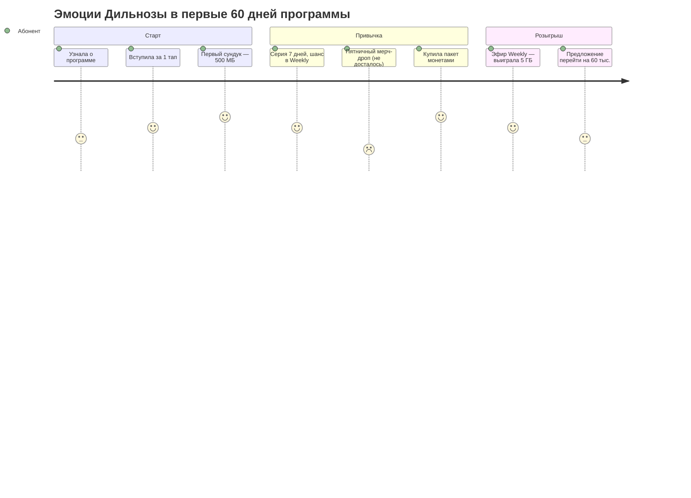

# 09. CJM (v2)

## 1. Персоны

| Персона | Профиль | Инициативы | Главная боль | Что мы даём |
|---|---|---|---|---|
| **Дильноза, 34, Ташкент** | 9 лет на старом пакете (АП 20 тыс.), смартфон, интернет кончается к 20-му | I1 / I2, I3a, Loyalty | «Опять дорожает» и «интернет закончился» | Переход с подарком, бустер в 1 клик, сундук каждый день |
| **Азиз, 27, Москва** | Номер Ucell для банка и семьи | I3b, Loyalty | Дорогой роуминг, боится потерять номер | «Musofir» −50% первый месяц; монеты за оплату вовремя |
| **Рустам-ака, 52, Фергана** | PAYG, редко в приложении | I1 (перевод с ценовой защитой), USSD-версия Loyalty | Не понимает изменений | Понятное SMS, USSD *XXX# «сундук», без давления |
| **Мухаббат-опа, 63** | Пенсионерка, 15+ лет с Ucell | Loyalty (уровень «Ehtirom») | Боится повышений | Цена не меняется; бонус стажа ×2 в розыгрышах |
| **Тимур, 29, АП 100 тыс.** | Активный пользователь приложения | Loyalty Premium | Хочет статус и крупные призы | 5% кэшбэк, 5 шансов, Premium-пул |

## 2. Путь в программе лояльности (Дильноза)

| Этап | 1. Узнала | 2. Вступила | 3. Первый сундук | 4. Привычка (2–4 нед.) | 5. Первая трата монет | 6. Розыгрыш | 7. Апгрейд |
|---|---|---|---|---|---|---|---|
| **Действие** | Push / баннер «Ucell Club: подарок каждый день» | 1 тап «Вступить», согласие с правилами | 3–4 тапа → 500 МБ | Открывает сундук ежедневно, серия 7 дней | Покупает пакет монетами | Получила 2 шанса, смотрит эфир | «Перейдите на 60 тыс. — 3 шанса и 4% кэшбэка» |
| **Точки контакта** | Приложение, SMS, офис | Приложение | Приложение (анимация) | Push 1 раз в день (настраивается) | Кошелёк | Instagram / Telegram live, push | Персональный оффер |
| **Эмоция** | 🤔 «опять акция?» | 🙂 | 😃 | 🙂 | 😊 «это реально деньги» | 😐 не выиграла / 🎉 выиграла | 🤔 → 🙂 |
| **Боль As-Is** | Недоверие к розыгрышам | Сложные правила | Пустой сундук = обида | Скука, однообразие | Монеты негде потратить | «Выигрывают свои» | «Меня заставляют платить больше» |
| **Решение To-Be** | Публичные победители по регионам, нотариус | Правила на 1 экране (uz / ru) | **Пустых сундуков нет** | Тематические дни, серии, мерч-дропы в пятницу | Пакеты и номера первыми в кошельке, мерч | Массовый уровень Weekly (1 354 приза), «второй шанс» | Апгрейд — выбор, а не условие; бонус +10 шансов |
| **Метрика** | CTR баннера | Конверсия во вступление | % открывших в 1-й день | DAU / участники, серии | Погашение, breakage | Охват эфира, NPS | Переходы vs контроль |

## 3. Путь при миграции (I1) — точки «боли» и как гасим

| T−60 | T−15 | T0 | T+30 | T+90 |
|---|---|---|---|---|
| «Выберите сами» + 500 монет и 3 сундука | Уведомление: сумма «было → стало», что добавлено, бесплатная смена | Перевод, SMS-подтверждение, остатки сохранены | Right-size, если новый тариф велик | Опрос CSAT; если ушёл — win-back с бонусом |

## 4. Путь мигранта (I3b + Loyalty)

Оффер до выезда → регистрация в роуминге → «Musofir −50%» → монеты за оплату вовремя из-за рубежа
(оплата картой или через приложение) → по возвращении «С возвращением» + сундук-бонус.

## 5. Тексты (черновики для Legal / PR)

**Вступление (uz):** «Ucell Club'ga xush kelibsiz! Har kuni sandiqni oching — sovg'a kafolatlangan. To'lovni o'z vaqtida qiling —
3–5% keshbek va haftalik o'yinlarda imkoniyatlar.»

**Вступление (ru):** «Добро пожаловать в Ucell Club! Открывайте сундук каждый день — подарок гарантирован. Платите вовремя —
кэшбэк 3–5% и шансы в еженедельных розыгрышах.»

**Не выиграл (ru):** «В этот раз не повезло, но ваши шансы растут: серия 7 дней и оплата вовремя дают +2 шанса на следующей
неделе. А сундук завтра снова ваш.»
