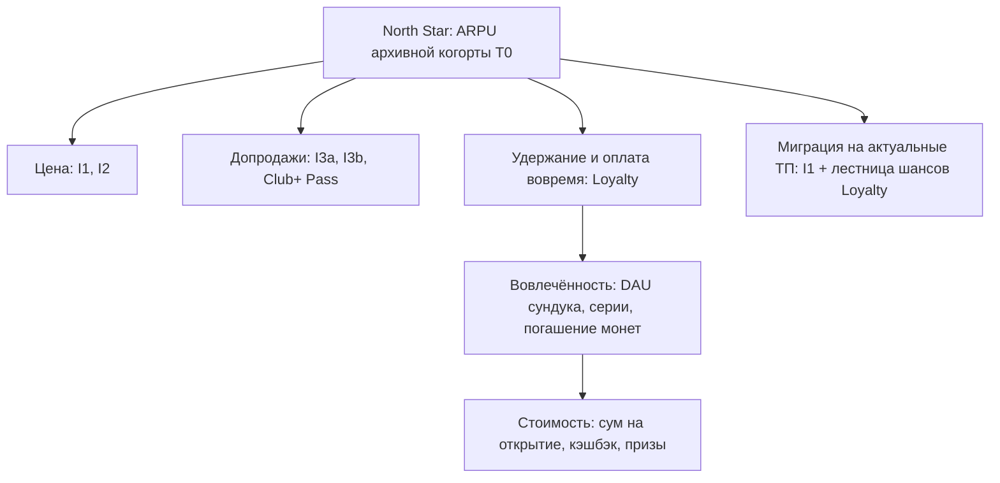

# 11. Data-Driven: дизайн MVP Loyalty и экспериментов

## 1. Дерево метрик

| Тип | Метрика | Порог-алерт |
|---|---|---|
| North Star | ARPU когорты T0 vs глобальный holdout 5% | — |
| Loyalty — результат | Отток участников, доля оплат вовремя, переходы на ТП ≥ 60 тыс., выручка Pass | — |
| Loyalty — вовлечённость | Вступление из MAU, DAU / участники, серии 7+, погашение, breakage | DAU < 15% на 4-й неделе |
| Loyalty — стоимость | Сум на открытие (≤ 55 цифровые), стоимость на участника (≤ 1 900 сум/мес.), доля призов от партнёров | Перерасход недельного лимита > 10% |
| Guardrails | Жалобы, NPS, обращения в КЦ, антифрод (аномальные открытия), отписки от push | Жалобы > 2× нормы |

## 2. Дизайн MVP (март–май 2027, 12 недель)

**Выборка:** 230 тыс. активных пользователей приложения, рандомизация со стратификацией по полосе АП,
архивный / актуальный тариф, региону и стажу.

| Ветка | N | Что получают |
|---|---|---|
| **A — O5 «лестница»** | 75 тыс. | Кэшбэк 3/4/5%, сундук, Weekly / Monthly для всех, кто платит вовремя (1/2/3/5 шансов), Club+ Pass, бонус за переход |
| **B — O2 «порог»** | 75 тыс. | Кэшбэк, сундук для всех; Weekly / Monthly — только АП ≥ 60 тыс. и оплата вовремя; без Pass |
| **Holdout** | 80 тыс. | Ничего (обычное приложение) |

Архивных абонентов в выборке — не меньше 40 тыс. (с избыточным отбором), чтобы отдельно увидеть влияние на них.

**Мощность** (α 5%, мощность 80%):
- отток 1,2% → 1,0%: ~42,7 тыс. на группу;
- оплата вовремя 85% → 87%: ~4,7 тыс.;
- переходы на ≥ 60 тыс. 0,3% → 0,6%: ~7,8 тыс.;
- ARPU +2% (CV 1,2): ~56,5 тыс. на группу. С CUPED (ковариата — ARPU за 3 мес. до старта) нужно меньше.

**Для оттока 12 недель мало.** Решение G3 принимаем по опережающим индикаторам: оплата вовремя, DAU, переходы.
Отток досматриваем ещё 3 мес. в режиме «MVP продолжает работать»: участникам программу не отключаем —
отключение само создаёт негатив.

## 3. Правила решения на G3 (разбор MVP, 15.06.2027)

| Результат MVP | Решение |
|---|---|
| A лучше holdout по оплате вовремя (+2 п.п.) и переходам (+0,3 п.п.), DAU ≥ 25%, стоимость ≤ 1 900 сум | **Масштаб по схеме O5** |
| B лучше A по переходам на ≥ 2× и без роста негатива | Масштаб по O2, но Daily Drops и кэшбэк оставить всем |
| Эффект только на вовлечённость, без денег | Сократить призовые фонды на 30–50%, перезапустить MVP-2 на 8 недель |
| Стоимость > 2 500 сум на участника и эффекты ниже MDE | Остановить; оставить только кэшбэк за оплату вовремя (дёшево) |

## 4. Эксперименты I1–I3

| # | Дизайн | N | Метрика | Стоп-критерий |
|---|---|---|---|---|
| I2 | Holdout / +4 000 / +6 000 сум (стратификация по ТП, региону, стажу) | ~25 тыс. на ветку | ARPU, даунгрейд, отток | Отток тест − контроль > 1,5 п.п. за 45 дней |
| I3a | Holdout / оффер / оффер + автопродление | ~17 тыс. | Выручка бустеров | Отписки, жалобы |
| I3b | Holdout / −50% / −30% | ~10 тыс. | Покупки, отток адоптеров | — |
| I1 | Волна 1 с holdout 5% (перевод откладывается) | ≥ 50 тыс. | ARPU, отток, КЦ | Доп. отток > 4% |

## 5. Дашборд программы

1. **Когорта:** ARPU, выручка, отток — тест vs holdout, по сегментам.
2. **Loyalty, ежедневно:** вступления, DAU сундука, распределение призов, остаток недельного инвентаря,
   сум на открытие, погашения монет, Pass.
3. **Партнёры:** показы → клики → погашения по каждому партнёру.
4. **Guardrails:** жалобы, обращения в КЦ, антифрод-алерты.
5. **Модель vs факт:** P50 из `results_v2.json` против фактической инкрементальной выручки.
