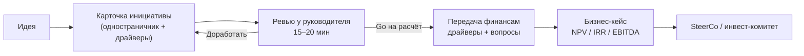

# Как показывать инициативы руководителю и передавать финансам

Файл: **`Initiative_Brief_Template.xlsx`** (пересборка: `python v2/templates/build_initiative_template.py`).

## 1. Путь инициативы

## 2. Формат для руководителя

**Одностраничник** (блок 1 карточки) + при необходимости 3–5 слайдов. Руководителю не нужны 30 страниц —
ему нужно за 2 минуты понять, стоит ли тратить время финансов.

| Раздел | Что писать | Ошибка, которой избегаем |
|---|---|---|
| Проблема | Одно предложение **с цифрой** («~775 тыс. абонентов платят на 4–6 тыс. ниже линейки») | «Нужно поднять ARPU» без цифр |
| Цель и метрика | Метрика, цель, срок, ограничение («+4% ARPU за 12 мес., отток ≤ 3%») | Цель без guardrail |
| Сегмент | Кто именно и сколько | «Все абоненты» |
| Механика | Что видит абонент, по шагам | Технические детали биллинга |
| Почему сработает | 2–3 бенчмарка или собственные данные | «Мы думаем, что…» |
| Гипотеза | «Если…, то…, потому что…» | Нет проверяемого утверждения |
| Сроки | Пилот → решение → масштаб, с датами | Нет пилота |
| Риски | 2–3 главных + что делаем | Список из 15 рисков |
| **Решение** | Какое решение нужно **сегодня** | Встреча «для информации» |

**Повестка ревью (15–20 мин):** 2 мин проблема → 3 мин механика → 5 мин цифры (быстрый расчёт, 3 сценария) →
5 мин риски и вопросы → 2 мин решение («передаём в финансы» / «доработать X»).

## 3. Что передавать финансам (и чего не делать за них)

| Передаёте вы (PM) | Делают финансы |
|---|---|
| Драйверы в 3 сценариях: размер группы, охват, конверсия, Δ платежа, даунгрейд, отток, каннибализация, сроки | Дисконтирование, NPV / IRR, горизонт |
| Источник и уверенность **по каждому числу** + кто даёт данные | Налоги, амортизация CAPEX |
| Оценки CAPEX / OPEX от владельцев (IT, биллинг, маркетинг) | Аллокация общих затрат |
| KPI, контрольная группа, стоп-критерии | Учёт по МСФО (IFRS 15 для бонусов) |
| Список вопросов к финансам (блок 4) | Итоговый P&L, влияние на EBITDA |

**Быстрый расчёт** (блок 3) — это sanity-check порядка цифр, а не бизнес-кейс. Он не учитывает естественный отток,
дисконтирование и налоги. Если быстрый расчёт в базовом сценарии не окупается — до финансов не доводим.

**Порог передачи:** чек-лист «Definition of Ready» (блок 6) ≥ 80%.

## 4. Как пользоваться файлом

1. Скопируйте лист «Пустой шаблон» и переименуйте (I5, I6…).
2. Заполните блок 1 — покажите руководителю.
3. Заполните драйверы (синие ячейки): база / пессимист / оптимист, источник, уверенность, владелец данных.
4. Проверьте быстрый расчёт и чек-лист.
5. Добавьте строку в лист «Портфель» (ссылки на ячейки нового листа — как у I1–I4).
6. Отправьте финансам файл + список вопросов (блок 4).

Листы I1–I4 заполнены по v2 как пример; их числа — гипотезы до данных аналитиков.
